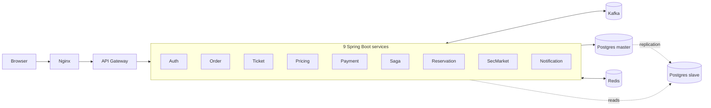
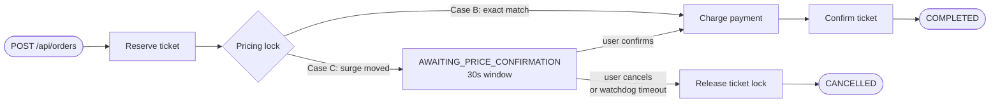

# Ticketing Platform

Microservice ticketing system — Java 21 + Spring Boot 3.2 + Kafka + Redis + Postgres.

## Prerequisites

| Tool           | Version |
| -------------- | ------- |
| Java           | 21+     |
| Maven          | 3.9+    |
| Docker         | 24+     |
| Docker Compose | 2.24+   |

## System architecture

Four-tier topology. Browser → nginx (edge) → API gateway (auth + circuit-breaker + rate-limit) →
nine Spring Boot services that communicate **only via Kafka** (no service-to-service HTTP for
business workflows) → shared Postgres + Redis storage.



> ▶️ **[Animated saga flows](./docs/animated-flows.html)** — interactive play/pause/step demo
> of all three order-placement scenarios.
> 📊 **[Static sequence diagrams](./docs/diagrams.html)** — full mermaid sequence diagrams per flow.
>
> Best viewed via GitHub Pages: `https://xol60.github.io/ticketing-platform/animated-flows.html`
> (see [docs hosting](#docs-hosting) below to enable in one click).

Key properties:

- **No HTTP between services for business workflows** → a downed service degrades into consumer
  lag, not cascading 5xx.
- **9 logical Postgres DBs on one master** → bounded-context isolation without paying for 9 clusters.
- **Redis is acceleration, not source of truth** → saga state writes Postgres first; Redis outage
  causes slow reads, not data loss.

## Project structure

```
ticketing-platform/
├── common-lib/              # Shared events, DTOs, exceptions
├── api-gateway/             # Reactive gateway — traceId, rate limiter, circuit breaker, auth cache
├── auth-service/            # JWT issue + refresh
├── ticket-service/          # Aggregate root, inventory lock
├── order-service/           # Workflow orchestrator
├── saga-orchestrator/       # Distributed transaction middleware
├── pricing-service/         # Dynamic pricing + Redis pub/sub
├── reservation-service/     # Waitlist queue
├── payment-service/         # External payment + DLQ + admin alert
├── secondary-market-service/# Ticket resale
├── notification-service/    # Email / push
└── docker/
    ├── kafka/               # Topic creation script
    ├── postgres/            # Master config + slave init
    ├── redis/               # redis.conf
    └── nginx/               # nginx.conf
```

## Quick start

### 1. Clone and configure

```bash
cp .env.example .env
# Generate a real JWT secret
openssl rand -base64 32
# Paste the output into .env as JWT_SECRET
```

### 2. Build all services

```bash
mvn clean package -DskipTests
```

### 3. Run (development)

Exposes all service ports locally and enables DEBUG logging + JVM remote debug on each service:

```bash
docker-compose -f docker-compose.yml -f docker-compose.dev.yml up --build
```

Remote debug ports: `508{1-9}` — e.g. auth-service → `5081`, ticket-service → `5082`.

### 4. Run (production)

Adds `restart: always`, memory/CPU limits, and hides all ports except Nginx:80:

```bash
docker-compose -f docker-compose.yml -f docker-compose.prod.yml up -d
```

### 5. Run (bare / default)

```bash
docker-compose up --build
```

### 6. Verify health

```bash
# Gateway (via nginx)
curl http://localhost/actuator/health

# Direct service ports (dev mode only)
curl http://localhost:8082/actuator/health   # ticket-service
curl http://localhost:8083/actuator/health   # order-service
```

## Development workflow

### Run a single service locally against Docker infra

```bash
# Start infra only
docker-compose up postgres-master redis kafka kafka-init -d

# Run any service with the 'local' profile (uses localhost ports)
cd ticket-service
mvn spring-boot:run -Dspring-boot.run.profiles=local
```

### Rebuild one service without restarting everything

```bash
docker-compose up --build --no-deps ticket-service
```

## Service ports (internal Docker network)

| Service              | Port                           |
| -------------------- | ------------------------------ |
| Nginx (public)       | 80                             |
| API Gateway          | 8090                           |
| Auth Service         | 8081                           |
| Ticket Service       | 8082                           |
| Order Service        | 8083                           |
| Saga Orchestrator    | 8084                           |
| Pricing Service      | 8085                           |
| Reservation Service  | 8086                           |
| Payment Service      | 8087                           |
| Secondary Market     | 8088                           |
| Notification Service | 8089                           |
| Postgres Master      | 5432 (internal) / 5436 (host)  |
| Redis                | 6379                           |
| Kafka                | 9092 (internal) / 29092 (host) |

## Kafka topics

25 topics, all saga-flow topics keyed by `orderId` with **3 partitions** to match
`concurrency=3` on every consumer. Two topics keep **1 partition** intentionally
(`payment.dlq`, `auth.security.alert`) so that DLQ replay and security forensics get
strict global ordering.

### Unified command topics — the key ordering decision

`ticket-service` and `payment-service` each accept **multiple command types on one
topic** instead of one topic per command:

| Service         | Unified topic | Carries                                                                |
| --------------- | ------------- | ---------------------------------------------------------------------- |
| ticket-service  | `ticket.cmd`  | `TicketReserveCommand`, `TicketConfirmCommand`, `TicketReleaseCommand` |
| payment-service | `payment.cmd` | `PaymentChargeCommand`, `PaymentCancelCommand`                         |

If `Release` and `Confirm` lived on separate topics, two consumer threads could pick
them up concurrently — `Release` winning the race would emit a spurious
`TicketReservationFailed`. The payment analogue is worse: a `Cancel` processed before
its preceding `Charge` would silently drop, leaving the customer charged. Unified
topics + `orderId` partition key guarantee strict per-order ordering without any
application-level locking.

### Catalog (consolidated)

| Domain      | Topic                   | Producers               | Consumers          | Carries (event/command DTOs)                   | P     | Key      |
| ----------- | ----------------------- | ----------------------- | ------------------ | ---------------------------------------------- | ----- | -------- |
| Order       | `order.created`         | order, secondary-market | saga               | `OrderCreatedEvent`                            | 3     | orderId  |
| Order       | `order.confirmed`       | saga                    | order              | `OrderConfirmedEvent`                          | 3     | orderId  |
| Order       | `order.failed`          | saga                    | order              | `OrderFailedEvent`                             | 3     | orderId  |
| Order       | `order.cancelled`       | saga                    | order              | `OrderCancelledEvent`                          | 3     | orderId  |
| Order       | `order.price.changed`   | saga                    | order              | `OrderPriceChangedEvent`                       | 3     | orderId  |
| Order       | `order.price.confirm`   | order                   | saga               | `OrderPriceConfirmCommand`                     | 3     | orderId  |
| Order       | `order.price.cancel`    | order                   | saga               | `OrderPriceCancelCommand`                      | 3     | orderId  |
| Ticket      | **`ticket.cmd`**        | saga                    | ticket             | `Reserve` / `Confirm` / `Release` Command      | 3     | orderId  |
| Ticket      | `ticket.reserved`       | ticket                  | saga               | `TicketReservedEvent`                          | 3     | orderId  |
| Ticket      | `ticket.released`       | ticket                  | saga, reservation  | `TicketReleasedEvent`                          | 3     | orderId  |
| Ticket      | `ticket.confirmed`      | ticket                  | saga, notification | `TicketConfirmedEvent`                         | 3     | orderId  |
| Pricing     | `pricing.lock.cmd`      | saga                    | pricing            | `PriceLockCommand`                             | 3     | orderId  |
| Pricing     | `pricing.locked`        | pricing                 | saga               | `PricingLockedEvent`                           | 3     | orderId  |
| Pricing     | `pricing.price.changed` | pricing                 | saga               | `PriceChangedEvent`                            | 3     | orderId  |
| Pricing     | `pricing.failed`        | pricing                 | saga               | `PricingFailedEvent`                           | 3     | orderId  |
| Pricing     | `price.updated`         | pricing                 | (SSE push)         | `PriceUpdatedEvent`                            | 3     | eventId  |
| Payment     | **`payment.cmd`**       | saga                    | payment            | `Charge` / `Cancel` Command                    | 3     | orderId  |
| Payment     | `payment.succeeded`     | payment                 | saga               | `PaymentSucceededEvent`                        | 3     | orderId  |
| Payment     | `payment.failed`        | payment                 | saga               | `PaymentFailedEvent`                           | 3     | orderId  |
| Payment     | `payment.refunded`      | payment                 | saga               | `PaymentRefundedEvent`                         | 3     | orderId  |
| Payment     | `payment.dlq`           | payment                 | notification       | `PaymentFailedEvent` (after retries exhausted) | **1** | orderId  |
| Reservation | `reservation.promoted`  | reservation             | order              | `ReservationPromotedEvent`                     | 3     | ticketId |
| Event mgmt  | `event.status.changed`  | ticket                  | (subscribers)      | `EventStatusChangedEvent`                      | 3     | eventId  |
| Notif       | `notification.send`     | any service             | notification       | `NotificationSendCommand`                      | 3     | orderId  |
| Security    | `auth.security.alert`   | auth                    | notification       | `AuthSecurityAlertEvent`                       | **1** | userId   |

P = partitions. `payment.dlq` and `auth.security.alert` keep 1 partition for strict
global ordering (chronological DLQ replay and security forensics).

## Order placement — saga flows

Three end-to-end flows triggered by `POST /api/orders`, all sharing the first four hops
and diverging at the **pricing-lock** step.

> ▶️ **[Animated saga flows](./docs/animated-flows.html)** — interactive play/pause/step demo of
> all three scenarios. Best way to see the system breathe.
> 📊 **[Static sequence diagrams](./docs/diagrams.html)** — full sequence diagrams per flow.



| Flow                          | Divergence rule                                      | Saga      | Order     | Ticket    | Payment       |
| ----------------------------- | ---------------------------------------------------- | --------- | --------- | --------- | ------------- |
| **1 — Happy path**            | `userPrice == facePrice × multiplierAtOrderTime`     | COMPLETED | CONFIRMED | CONFIRMED | SUCCESS       |
| **2 — Accept new price**      | Case C → user POSTs `/confirm-price`                 | COMPLETED | CONFIRMED | CONFIRMED | SUCCESS (new) |
| **3 — Decline / 30s timeout** | Case C → `/cancel-price` **or** SagaWatchdog expires | CANCELLED | CANCELLED | AVAILABLE | (none)        |

All three flows converge to a **fully consistent terminal state across 4 databases** —
no orphan rows, no half-charged payments, no leaked ticket locks.

## Performance, scaling & state synchronization

### Throughput at a single-replica baseline

| Layer                      | Capacity              | Limited by                                |
| -------------------------- | --------------------- | ----------------------------------------- |
| Order API ingress          | ~2,000 req/s          | Nginx `limit_req` (200r/s/IP × keepalive) |
| Kafka consumer per service | ~600 msg/s            | 3 partitions × ~5ms DB tx                 |
| End-to-end saga (10 hops)  | < 1s p50, < 2s p99    | Race-test measured                        |
| Payment retry watchdog     | 50 payments / 2s tick | `BATCH_SIZE=50`, `fixedDelay=2s`          |
| SSE connections per pod    | ~10,000               | Nginx `worker_connections × cores`        |

### Where the bottleneck sits

```
Redis read       <  1 ms
Kafka roundtrip  1–2 ms
DB transaction   5–15 ms     ← actual bottleneck
Payment gateway  50–200 ms   ← OFFLOADED to watchdog, off consumer thread
```

Originally bottlenecked at the payment gateway because `gateway.charge() + Thread.sleep()`
ran on the Kafka consumer thread, freezing the partition. Refactored to a claim-lease
pattern in [`PaymentRetryWatchdog`](payment-service/src/main/java/com/ticketing/payment/watchdog/PaymentRetryWatchdog.java) —
consumer throughput jumped from ~15 → ~300 msg/s per partition.

### Horizontal scaling — pure ops, no code change

Every service is **stateless at the JVM level** (state lives in Postgres / Redis / Kafka),
so adding replicas is a Kafka rebalance:

| Action         | How                                                                 | Effect                                |
| -------------- | ------------------------------------------------------------------- | ------------------------------------- |
| Scale-out (HA) | `docker compose up -d --scale ticket-service=3`                     | Same throughput, 2-pod loss tolerance |
| Scale-up (TPS) | Bump partitions in `create-topics.sh` (idempotent), then scale pods | Linear up to partition count          |
| More DB reads  | Add a second `postgres-slave` + update routing                      | 2× read QPS                           |
| More Redis ops | Switch to Redis cluster (3 master + 3 replica)                      | 100k → 1M ops/s                       |

**Hard constraint:** `partitions ≥ total_consumer_threads` per service. The
`ensure_partitions` helper in `create-topics.sh` is idempotent so bumps don't require redeploy.

### Cross-instance synchronization

Two pods consuming different partitions can race on the same `orderId` or the same DB row.
Every such race closes at a **durable boundary** — DB, Kafka, or Redis. Application-level
locks are intentionally absent because they don't survive pod restart.

| Mechanism                             | Closes which race                                       |
| ------------------------------------- | ------------------------------------------------------- |
| Optimistic `@Version` on entities     | Two pods writing the same row concurrently              |
| UNIQUE partial index                  | DB-level overselling / double-listing                   |
| Kafka consumer-group assignment       | Two pods consuming the same partition (broker enforced) |
| `orderId` partition key               | `Release` overtaking `Reserve` across pods              |
| Claim-lease (`nextRetryAt` window)    | Two payment pods double-charging the same payment       |
| Redis `SETNX` distributed lock        | Two pods promoting the same waitlist head               |
| Write-through saga state (PG → Redis) | Lost progress on Redis flush or pod restart             |
| Idempotency (sagaId / payment state)  | Duplicate processing on Kafka redelivery                |

## Docs hosting

The two interactive pages (`docs/animated-flows.html`, `docs/diagrams.html`) need to be served
over HTTP for the mermaid CDN and ES-module imports to load. Three options:

| Method                          | URL                                                                       | Quality                    |
| ------------------------------- | ------------------------------------------------------------------------- | -------------------------- |
| **GitHub Pages** (recommended)  | `https://xol60.github.io/ticketing-platform/animated-flows.html`          | ✅ Fast, full JS, clean URL |
| **Local browser** (file open)   | `open docs/animated-flows.html`                                           | ✅ Works offline            |
| `htmlpreview.github.io` (proxy) | `https://htmlpreview.github.io/?https://github.com/…/docs/diagrams.html`  | ⚠ Sandboxed iframe — mermaid CDN can be blocked, raw source may show |

### Enabling GitHub Pages (one-time, ~30 seconds)

1. Push the repo to GitHub.
2. **Settings → Pages** → Source: **Deploy from a branch** → Branch: `main` / Folder: `/docs`.
3. Save. URL appears within ~1 minute:
   - `https://xol60.github.io/ticketing-platform/animated-flows.html`
   - `https://xol60.github.io/ticketing-platform/diagrams.html`

This is the path recruiters will actually click on — no proxy, no sandboxing, full rendering.

## Architecture decisions

### Auth — gateway-only, internal trust model

JWT is validated once at the API Gateway using a two-layer cache (L1 in-process LRU + L2 Redis).
Internal services receive `X-User-Id`, `X-User-Role`, `X-Trace-Id` headers — no JWT re-validation.
Internal services are network-isolated: only reachable from within the Docker network.

### Saga — orchestration pattern

The `saga-orchestrator` drives each transaction step explicitly via Kafka commands.
State is persisted in Redis (`saga:{sagaId}`) with TTL-based watchdog for stuck sagas.
Compensation runs in reverse order on any step failure.

### Database — master/slave read routing

All writes go to `postgres-master`. Reads follow: L1 cache → L2 Redis → postgres-slave.
Each service has its own database (bounded context isolation — no cross-service SQL).

### Circuit breaker + rate limiter — gateway only

Resilience4j circuit breaker wraps each upstream service independently.
Rate limiter uses Redis sliding window counters keyed by `IP:userId`.
