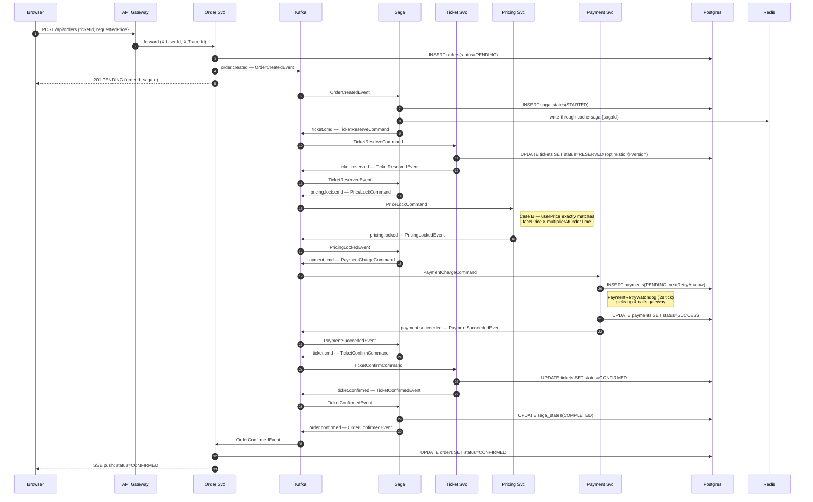
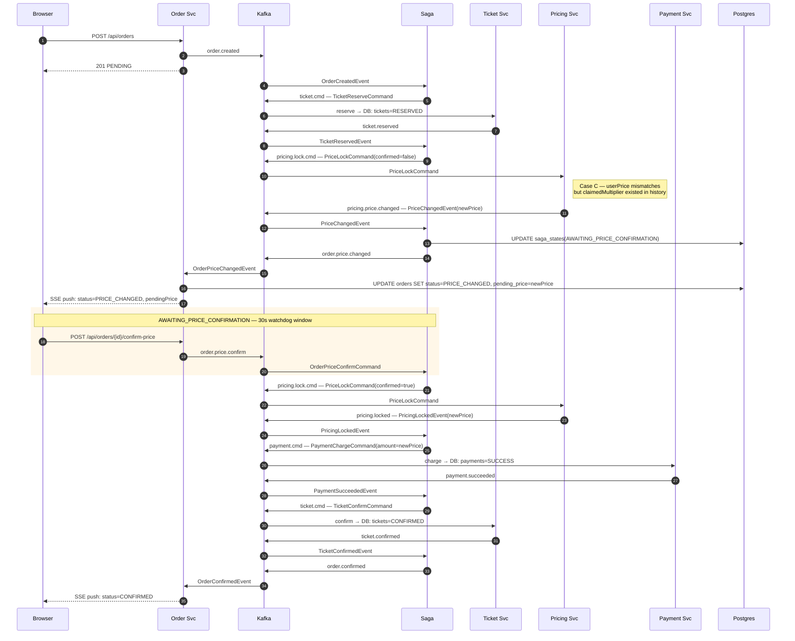

# Ticketing Platform

Microservice ticketing system — Java 21 + Spring Boot 3.2 + Kafka + Redis + Postgres.

## Prerequisites

| Tool           | Version |
| -------------- | ------- |
| Java           | 21+     |
| Maven          | 3.9+    |
| Docker         | 24+     |
| Docker Compose | 2.24+   |

## System architecture

A four-tier topology: nginx terminates HTTP at the edge, the API gateway centralizes
auth/rate-limiting/circuit-breaking, nine application services communicate **only via
Kafka events** (no direct service-to-service HTTP for business logic), and shared
infrastructure handles persistence + caching.

```mermaid
graph TB
    Browser["🌐 Browser — React SPA<br/>(JWT + SSE client)"]

    subgraph EDGE [" Edge tier "]
        Nginx["Nginx<br/>rate-limit • gzip • SSE buffering off"]
    end

    subgraph GATEWAY [" Gateway tier "]
        Gateway["API Gateway (WebFlux)<br/>JWT validation • Resilience4j CB<br/>Redis sliding-window rate-limit"]
    end

    subgraph APP [" Application tier — 9 Spring Boot services "]
        direction LR
        Auth[Auth]
        Order[Order]
        Ticket[Ticket]
        Pricing[Pricing]
        Payment[Payment]
        Saga[Saga<br/>Orchestrator]
        Reservation[Reservation]
        SecMarket[Secondary<br/>Market]
        Notif[Notification]
    end

    Kafka[("Apache Kafka<br/>28 topics • orderId-keyed • 3 partitions")]

    subgraph STORAGE [" Storage tier "]
        direction LR
        PgM[("Postgres Master<br/>9 logical DBs<br/>(bounded contexts)")]
        PgS[("Postgres Slave<br/>read replicas")]
        Redis[("Redis<br/>L2 cache • saga state<br/>distributed locks<br/>rate-limit counters")]
    end

    Browser ==>|HTTPS| Nginx
    Browser <-.SSE long-lived.- Nginx
    Nginx --> Gateway
    Gateway --> APP

    APP <-->|"produce / consume"| Kafka

    APP -->|writes| PgM
    APP -.reads.-> PgS
    APP <-->|cache + state| Redis
    PgM -.streaming replication.-> PgS

    classDef edge fill:#e3f2fd,stroke:#1976d2
    classDef gw fill:#fff3e0,stroke:#f57c00
    classDef app fill:#f3e5f5,stroke:#7b1fa2
    classDef store fill:#e8f5e9,stroke:#388e3c
    class Nginx edge
    class Gateway gw
    class Auth,Order,Ticket,Pricing,Payment,Saga,Reservation,SecMarket,Notif app
    class Kafka,PgM,PgS,Redis store
```

**Notable properties of this layout:**

- **No HTTP between services for business workflows** — every cross-service interaction
  flows through Kafka, so a downed service degrades into consumer-lag, not cascading failure.
- **9 logical Postgres databases on one master** — bounded-context isolation without
  paying for 9 physical clusters; can be split horizontally if any one DB outgrows the master.
- **Redis is acceleration, not source of truth** — saga state is write-through to Postgres
  first; a Redis outage degrades to slow reads, not data loss.
- **Single read replica covers all services** — sufficient for current load; production
  would partition by service or use per-service replicas.

## Project structure

```
ticketing-platform/
├── common-lib/              # Shared events, DTOs, exceptions
├── api-gateway/             # Reactive gateway — traceId, rate limiter, circuit breaker, auth cache
├── auth-service/            # JWT issue + refresh
├── ticket-service/          # Aggregate root, inventory lock
├── order-service/           # Workflow orchestrator
├── saga-orchestrator/       # Distributed transaction middleware
├── pricing-service/         # Dynamic pricing + Redis pub/sub
├── reservation-service/     # Waitlist queue
├── payment-service/         # External payment + DLQ + admin alert
├── secondary-market-service/# Ticket resale
├── notification-service/    # Email / push
└── docker/
    ├── kafka/               # Topic creation script
    ├── postgres/            # Master config + slave init
    ├── redis/               # redis.conf
    └── nginx/               # nginx.conf
```

## Quick start

### 1. Clone and configure

```bash
cp .env.example .env
# Generate a real JWT secret
openssl rand -base64 32
# Paste the output into .env as JWT_SECRET
```

### 2. Build all services

```bash
mvn clean package -DskipTests
```

### 3. Run (development)

Exposes all service ports locally and enables DEBUG logging + JVM remote debug on each service:

```bash
docker-compose -f docker-compose.yml -f docker-compose.dev.yml up --build
```

Remote debug ports: `508{1-9}` — e.g. auth-service → `5081`, ticket-service → `5082`.

### 4. Run (production)

Adds `restart: always`, memory/CPU limits, and hides all ports except Nginx:80:

```bash
docker-compose -f docker-compose.yml -f docker-compose.prod.yml up -d
```

### 5. Run (bare / default)

```bash
docker-compose up --build
```

### 6. Verify health

```bash
# Gateway (via nginx)
curl http://localhost/actuator/health

# Direct service ports (dev mode only)
curl http://localhost:8082/actuator/health   # ticket-service
curl http://localhost:8083/actuator/health   # order-service
```

## Development workflow

### Run a single service locally against Docker infra

```bash
# Start infra only
docker-compose up postgres-master redis kafka kafka-init -d

# Run any service with the 'local' profile (uses localhost ports)
cd ticket-service
mvn spring-boot:run -Dspring-boot.run.profiles=local
```

### Rebuild one service without restarting everything

```bash
docker-compose up --build --no-deps ticket-service
```

## Service ports (internal Docker network)

| Service              | Port                           |
| -------------------- | ------------------------------ |
| Nginx (public)       | 80                             |
| API Gateway          | 8090                           |
| Auth Service         | 8081                           |
| Ticket Service       | 8082                           |
| Order Service        | 8083                           |
| Saga Orchestrator    | 8084                           |
| Pricing Service      | 8085                           |
| Reservation Service  | 8086                           |
| Payment Service      | 8087                           |
| Secondary Market     | 8088                           |
| Notification Service | 8089                           |
| Postgres Master      | 5432 (internal) / 5436 (host)  |
| Redis                | 6379                           |
| Kafka                | 9092 (internal) / 29092 (host) |

## Kafka topics

All saga-flow topics use **3 partitions** to match `concurrency=3` on each consumer. Records
are partitioned by `orderId` so all events for the same order are processed in producer-send
order by exactly one consumer thread. `payment.dlq` and `auth.security.alert` keep
**1 partition** intentionally (see notes below).

### Command-topic consolidation

Two domains use a **single command topic per service** carrying multiple command types,
instead of one topic per command type. This is the most important ordering decision in
the system: all commands for the same `orderId` land on the same partition and are
consumed sequentially by one thread.

If `Release` and `Confirm` lived on separate topics, two consumer threads could pick them
up concurrently — `Release` winning the race would produce a spurious
`TicketReservationFailed` event. The payment analogue is worse: a `Cancel` processed
before its preceding `Charge` would silently drop, leaving the customer charged.

### Catalog — by domain

Format: **Event/Command** — name of the Java DTO produced onto the topic.

#### Order domain

| Event / Command             | Topic                  | Producer                                | Consumer                                | Partitions | Key       |
| --------------------------- | ---------------------- | --------------------------------------- | --------------------------------------- | ---------- | --------- |
| `OrderCreatedEvent`         | `order.created`        | order-service, secondary-market-service | saga-orchestrator                       | 3          | `orderId` |
| `OrderConfirmedEvent`       | `order.confirmed`      | saga-orchestrator                       | order-service                           | 3          | `orderId` |
| `OrderFailedEvent`          | `order.failed`         | saga-orchestrator                       | order-service                           | 3          | `orderId` |
| `OrderCancelledEvent`       | `order.cancelled`      | saga-orchestrator                       | order-service                           | 3          | `orderId` |
| `OrderPriceChangedEvent`    | `order.price.changed`  | saga-orchestrator                       | order-service                           | 3          | `orderId` |
| `OrderPriceConfirmCommand`  | `order.price.confirm`  | order-service                           | saga-orchestrator                       | 3          | `orderId` |
| `OrderPriceCancelCommand`   | `order.price.cancel`   | order-service                           | saga-orchestrator                       | 3          | `orderId` |

#### Ticket domain

| Event / Command          | Topic               | Producer          | Consumer                                | Partitions | Key       |
| ------------------------ | ------------------- | ----------------- | --------------------------------------- | ---------- | --------- |
| `TicketReserveCommand`   | `ticket.cmd`        | saga-orchestrator | ticket-service                          | 3          | `orderId` |
| `TicketConfirmCommand`   | `ticket.cmd`        | saga-orchestrator | ticket-service                          | 3          | `orderId` |
| `TicketReleaseCommand`   | `ticket.cmd`        | saga-orchestrator | ticket-service                          | 3          | `orderId` |
| `TicketReservedEvent`    | `ticket.reserved`   | ticket-service    | saga-orchestrator                       | 3          | `orderId` |
| `TicketReleasedEvent`    | `ticket.released`   | ticket-service    | saga-orchestrator, reservation-service  | 3          | `orderId` |
| `TicketConfirmedEvent`   | `ticket.confirmed`  | ticket-service    | saga-orchestrator, notification-service | 3          | `orderId` |

#### Pricing domain

| Event / Command         | Topic                   | Producer          | Consumer              | Partitions | Key       |
| ----------------------- | ----------------------- | ----------------- | --------------------- | ---------- | --------- |
| `PriceLockCommand`      | `pricing.lock.cmd`      | saga-orchestrator | pricing-service       | 3          | `orderId` |
| `PriceUnlockCommand`    | `pricing.unlock.cmd`    | saga-orchestrator | pricing-service       | 3          | `orderId` |
| `PricingLockedEvent`    | `pricing.locked`        | pricing-service   | saga-orchestrator     | 3          | `orderId` |
| `PriceChangedEvent`     | `pricing.price.changed` | pricing-service   | saga-orchestrator     | 3          | `orderId` |
| `PricingFailedEvent`    | `pricing.failed`        | pricing-service   | saga-orchestrator     | 3          | `orderId` |
| `PriceUpdatedEvent`     | `price.updated`         | pricing-service   | (SSE push to clients) | 3          | `eventId` |

#### Payment domain

| Event / Command          | Topic               | Producer          | Consumer             | Partitions | Key       |
| ------------------------ | ------------------- | ----------------- | -------------------- | ---------- | --------- |
| `PaymentChargeCommand`   | `payment.cmd`       | saga-orchestrator | payment-service      | 3          | `orderId` |
| `PaymentCancelCommand`   | `payment.cmd`       | saga-orchestrator | payment-service      | 3          | `orderId` |
| `PaymentSucceededEvent`  | `payment.succeeded` | payment-service   | saga-orchestrator    | 3          | `orderId` |
| `PaymentFailedEvent`     | `payment.failed`    | payment-service   | saga-orchestrator    | 3          | `orderId` |
| `PaymentRefundedEvent`   | `payment.refunded`  | payment-service   | saga-orchestrator    | 3          | `orderId` |
| `PaymentFailedEvent`     | `payment.dlq`       | payment-service   | notification-service | **1**      | `orderId` |

#### Saga / reservation / sale

| Event / Command            | Topic                  | Producer            | Consumer          | Partitions | Key        |
| -------------------------- | ---------------------- | ------------------- | ----------------- | ---------- | ---------- |
| `SagaCompensateCommand`    | `saga.compensate`      | saga-orchestrator   | ticket-service    | 3          | `orderId`  |
| `ReservationPromotedEvent` | `reservation.promoted` | reservation-service | order-service     | 3          | `ticketId` |
| `EventStatusChangedEvent`  | `event.status.changed` | ticket-service      | (subscribers)     | 3          | `eventId`  |
| `FlashSaleEvent`           | `sale.flash`           | ticket-service      | (subscribers)     | 3          | `eventId`  |

#### Notification / security

| Event / Command            | Topic                 | Producer     | Consumer             | Partitions | Key       |
| -------------------------- | --------------------- | ------------ | -------------------- | ---------- | --------- |
| `NotificationSendCommand`  | `notification.send`   | any service  | notification-service | 3          | `orderId` |
| `AuthSecurityAlertEvent`   | `auth.security.alert` | auth-service | notification-service | **1**      | `userId`  |

### Single-partition exceptions

- **`payment.dlq`** — DLQ replay must be strictly chronological across all orders so admins
  can reconstruct the failure timeline. Volume is low (only failed-after-retry payments).
- **`auth.security.alert`** — global ordering of suspicious-login events for forensics.
  Low volume; throughput is not a concern.

## Order placement — saga flows

Three end-to-end flows triggered by `POST /api/orders`. All three share the first four
hops; they diverge at the **pricing-lock** step depending on whether the user's
`requestedPrice` matches the current effective price. Each diagram includes the actual
Kafka topic carrying every message and the database written per step, so the diagrams
map 1-to-1 onto the System architecture topology above.

### Flow 1 — Happy path (price unchanged)

`requestedPrice == facePrice × surge_at_orderCreatedAt`. Saga walks all 10 hops without
compensation and terminates in `COMPLETED`.



### Flow 2 — Price changed, user **accepts** new price

Surge multiplier moved between `orderCreatedAt` and the pricing lock. Pricing service
emits `PriceChangedEvent`, saga pauses in `AWAITING_PRICE_CONFIRMATION`. User confirms
via REST → saga re-issues `PriceLockCommand{confirmed=true}` → resumes at the new price.



### Flow 3 — Price changed, user **declines** new price

Same divergence as Flow 2 up to `AWAITING_PRICE_CONFIRMATION`. User rejects (or watchdog
timeout fires). Saga compensates: release ticket → emit `OrderCancelledEvent`.

```mermaid
sequenceDiagram
    autonumber
    participant U  as Browser
    participant OS as Order Svc
    participant K  as Kafka
    participant SO as Saga
    participant TS as Ticket Svc
    participant PR as Pricing Svc
    participant DB as Postgres

    U  ->> OS: POST /api/orders
    OS ->> K:  order.created
    OS -->> U: 201 PENDING

    K  ->> SO: OrderCreatedEvent
    SO ->> K:  ticket.cmd — TicketReserveCommand
    K  ->> TS: reserve → DB: tickets=RESERVED
    TS ->> K:  ticket.reserved

    K  ->> SO: TicketReservedEvent
    SO ->> K:  pricing.lock.cmd
    K  ->> PR: PriceLockCommand
    PR ->> K:  pricing.price.changed — PriceChangedEvent

    K  ->> SO: PriceChangedEvent
    SO ->> DB: UPDATE saga_states(AWAITING_PRICE_CONFIRMATION)
    SO ->> K:  order.price.changed
    K  ->> OS: OrderPriceChangedEvent
    OS -->> U: SSE push: status=PRICE_CHANGED

    rect rgba(255, 100, 100, 0.15)
        Note over U,SO: AWAITING_PRICE_CONFIRMATION
        alt User declines
            U  ->> OS: POST /api/orders/{id}/cancel-price
            OS ->> K:  order.price.cancel
            K  ->> SO: OrderPriceCancelCommand
        else 30s watchdog timeout
            Note over SO: SagaWatchdog scans saga_states<br/>WHERE status='AWAITING_PRICE_CONFIRMATION'<br/>AND updated_at &lt; now-30s
        end
    end

    Note over SO: Compensation — release ticket lock
    SO ->> K:  saga.compensate — TicketReleaseCommand
    K  ->> TS: release → DB: tickets=AVAILABLE (version++)
    TS ->> K:  ticket.released

    K  ->> SO: TicketReleasedEvent
    SO ->> DB: UPDATE saga_states(CANCELLED)
    SO ->> K:  order.cancelled
    K  ->> OS: OrderCancelledEvent
    OS ->> DB: UPDATE orders SET status=CANCELLED
    OS -->> U: SSE push: status=CANCELLED
```

### Terminal-state matrix

| Flow            | Saga       | Order       | Ticket    | Payment       |
| --------------- | ---------- | ----------- | --------- | ------------- |
| 1 — Happy path  | COMPLETED  | CONFIRMED   | CONFIRMED | SUCCESS       |
| 2 — Accept new  | COMPLETED  | CONFIRMED   | CONFIRMED | SUCCESS (new) |
| 3 — Decline new | CANCELLED  | CANCELLED   | AVAILABLE | (none)        |

All three flows converge to a **fully consistent terminal state across 4 databases** —
no orphan rows, no half-charged payments, no leaked ticket locks.

## Performance, scaling & state synchronization

### Throughput envelope (single replica per service)

| Metric                              | Value                       | Source / bottleneck                              |
| ----------------------------------- | --------------------------- | ------------------------------------------------ |
| Order API ingress                   | ~2,000 req/s                | Nginx `limit_req zone=global rate=200r/s` × ~10 keepalive workers |
| Auth API ingress                    | ~100 req/s                  | Separate strict `auth` zone (10r/s/IP)           |
| Per-service Kafka consumer          | ~600 msg/s                  | 3 partitions × ~5ms tx ≈ 200 msg/s/thread        |
| End-to-end saga (10 hops)           | < 1s p50, < 2s p99          | Race-test measured (`./tests/race-test.md`)      |
| Payment retry watchdog              | 50 payments / 2s tick       | `BATCH_SIZE=50`, `fixedDelay=2_000`              |
| Reservation queue promotion         | ~200 promotions/s           | 1-partition `reservation.promoted` topic         |
| Saga watchdog scan                  | ~0 rows in healthy state    | `idx_saga_states_active_stale` partial index     |
| SSE concurrent connections per pod  | ~10,000                     | Nginx `worker_connections=4096` × cores          |

### Bottleneck ladder

Profiled in increasing cost — fixing layer N rarely helps if layer N+1 dominates:

```
1. Redis cache read              < 1 ms   — almost free
2. Kafka produce + consume       1–2 ms   — local broker network
3. Single DB transaction         5–15 ms  ← THE actual bottleneck
4. Payment gateway external call 50–200 ms ← offloaded to watchdog, OFF consumer thread
```

The system was originally bottlenecked at #4 because `gateway.charge() + Thread.sleep()`
ran on the Kafka consumer thread, blocking the entire partition.
[`PaymentRetryWatchdog`](payment-service/src/main/java/com/ticketing/payment/watchdog/PaymentRetryWatchdog.java)
moved the gateway call to a scheduler thread; consumer throughput jumped from ~15 msg/s
to ~300 msg/s per partition.

### Horizontal scaling — adding more instances

Each Spring Boot service is stateless at the JVM level (state lives in Postgres/Redis/Kafka),
so adding replicas is purely a Kafka rebalance + DB-pool sizing exercise:

```
3 partitions × 3 consumer threads = 3 effective workers
  └─ 1 pod × concurrency=3                 → 3 workers (current)
  └─ 3 pods × concurrency=1                → 3 workers (HA: pod loss = 1 worker)
  └─ Need >3 workers? bump partitions first
```

**Scaling playbook** (no code change required for any of these):

| Action                          | Command                                                        | New ceiling                  |
| ------------------------------- | -------------------------------------------------------------- | ---------------------------- |
| Scale-out (HA)                  | `docker compose up -d --scale ticket-service=3`                | Same throughput, survives 2 pod losses |
| Scale-up (throughput)           | edit `create-topics.sh`: 3 → 12 partitions, then `scale=4`     | 4× throughput                |
| Add DB read capacity            | add a second `postgres-slave`, update routing                  | 2× read QPS                  |
| Add Redis capacity              | switch to Redis cluster, 3 master + 3 replica                  | 100k → 1M ops/s              |

**Hard constraint**: `partitions ≥ total_consumer_threads` per service. If you scale to
4 pods × concurrency=3 = 12 threads but the topic only has 3 partitions, 9 threads sit
idle. The `ensure_partitions` block in `create-topics.sh` is idempotent precisely so
partition bumps don't require a new deploy.

### Cross-instance synchronization — how N replicas stay consistent

Adding instances of any service immediately introduces concurrency: two pods can pick
up two messages for the same `orderId` (different partitions) or race on the same
ticket. Every such race is closed by **one explicit mechanism**:

| Mechanism                              | Where                                       | What it prevents                                          |
| -------------------------------------- | ------------------------------------------- | --------------------------------------------------------- |
| **Optimistic lock `@Version`**         | `Ticket`, `Payment`, `Order` entities       | Two pods writing concurrently to the same row             |
| **UNIQUE partial index**               | `tickets.unique_seat`, `listings.one_active`| DB-level overselling / double-listing the same ticket     |
| **Kafka consumer-group assignment**    | All `@KafkaListener` annotations            | Two pods consuming the same partition (Kafka enforced)    |
| **`orderId` partition key**            | All saga-flow topics                        | `Release` overtaking `Reserve` across pods                |
| **Claim-lease** (`nextRetryAt` window) | `PaymentRetryWatchdog`                      | Two payment pods double-charging the same payment         |
| **Redis distributed lock** (`SETNX`)   | Reservation queue head promotion            | Two reservation pods promoting the same waitlist entry    |
| **Write-through saga state**           | Postgres-first, Redis-second                | Lost progress on Redis flush or pod restart               |
| **Idempotency check**                  | `Order.sagaId` uniqueness, payment status   | Duplicate processing on Kafka redelivery (at-least-once)  |
| **`updated_at` partial index**         | Saga watchdog scan                          | Wasted full-scan on terminal sagas every 30s              |

The design principle behind this table: **every cross-instance race must close at a
durable boundary** — either the DB (constraint or version), Kafka (partition assignment),
or Redis (lock). Application-level locks are intentionally absent because they don't
survive pod restart.

## Architecture decisions

### Auth — gateway-only, internal trust model

JWT is validated once at the API Gateway using a two-layer cache (L1 in-process LRU + L2 Redis).
Internal services receive `X-User-Id`, `X-User-Role`, `X-Trace-Id` headers — no JWT re-validation.
Internal services are network-isolated: only reachable from within the Docker network.

### Saga — orchestration pattern

The `saga-orchestrator` drives each transaction step explicitly via Kafka commands.
State is persisted in Redis (`saga:{sagaId}`) with TTL-based watchdog for stuck sagas.
Compensation runs in reverse order on any step failure.

### Database — master/slave read routing

All writes go to `postgres-master`. Reads follow: L1 cache → L2 Redis → postgres-slave.
Each service has its own database (bounded context isolation — no cross-service SQL).

### Circuit breaker + rate limiter — gateway only

Resilience4j circuit breaker wraps each upstream service independently.
Rate limiter uses Redis sliding window counters keyed by `IP:userId`.
