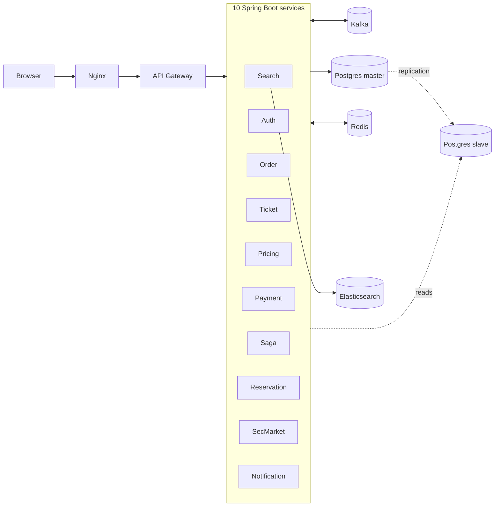
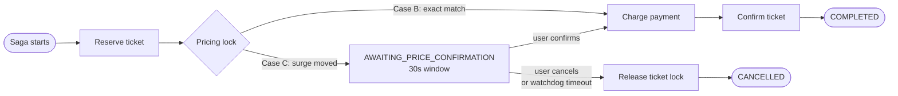

# Overture — Event Ticketing Platform

Microservice ticketing system — Java 21 + Spring Boot 3.2 + Kafka + Redis + Postgres.

## Prerequisites

| Tool           | Version |
| -------------- | ------- |
| Java           | 21+     |
| Maven          | 3.9+    |
| Docker         | 24+     |
| Docker Compose | 2.24+   |

## System architecture

Four-tier topology. Browser → nginx (edge) → API gateway (auth + circuit-breaker + rate-limit) →
ten Spring Boot services that communicate **only via Kafka** (no service-to-service HTTP for
business workflows) → shared Postgres + Redis + Elasticsearch storage.


```mermaid
flowchart LR
    Browser[Browser] --> Nginx
    Nginx --> Gateway[API Gateway]
    Gateway --> Services
    Services <--> Kafka[(Kafka)]
    Services --> PgMaster[(Postgres master)]
    Services -.reads.-> PgSlave[(Postgres slave)]
    Services <--> Redis[(Redis)]
    S10 --> ES[(Elasticsearch)]
    PgMaster -.replication.-> PgSlave

    subgraph Services[" 10 Spring Boot services "]
        S1[Auth]
        S2[Order]
        S3[Ticket]
        S4[Pricing]
        S5[Payment]
        S6[Saga]
        S7[Reservation]
        S8[SecMarket]
        S9[Notification]
        S10[Search]
    end
```

The **search-service** is intentionally out of the order saga — it consumes
`event.search.indexed` from Kafka and projects events into a read-only
Elasticsearch index. Postgres remains the source of truth; if ES or search-service
is down the rest of the platform keeps working.

> ▶️ **[Animated saga flows](https://htmlpreview.github.io/?https://github.com/xol60/ticketing-platform/blob/main/docs/animated-flows.html)** — interactive play/pause/step demo of all three scenarios.
> 📄 **[Static reference](https://htmlpreview.github.io/?https://github.com/xol60/ticketing-platform/blob/main/docs/diagrams.html)** — scroll-through version for readers who prefer text + step lists.

Key properties:

- **No HTTP between services for business workflows** → a downed service degrades into consumer
  lag, not cascading 5xx.
- **9 logical Postgres DBs on one master** → bounded-context isolation without paying for 9 clusters.
- **Redis is acceleration, not source of truth** → saga state writes Postgres first; Redis outage
  causes slow reads, not data loss.

## Project structure

Each service has its own README with API, internal architecture, and operational notes.

| Path | Headline |
| ---- | -------- |
| [`common-lib/`](common-lib)                                       | Shared events, DTOs, exceptions, the Stripe-pattern idempotency filter |
| [`api-gateway/`](api-gateway)                                     | Reactive gateway — traceId, rate limiter, circuit breaker, auth cache  |
| [`auth-service/`](auth-service)                                   | JWT issue + refresh                                                    |
| [`ticket-service/`](ticket-service)                               | Aggregate root, inventory lock, hot consumer at `concurrency=10`       |
| [`order-service/`](order-service)                                 | Workflow orchestrator + HTTP idempotency on `POST /api/orders`         |
| [`saga-orchestrator/`](saga-orchestrator)                         | Distributed transaction middleware, 11 saga listeners                  |
| [`pricing-service/`](pricing-service)                             | Dynamic surge pricing with point-in-time validation                    |
| [`reservation-service/`](reservation-service)                     | Waitlist queue                                                         |
| [`payment-service/`](payment-service)                             | External payment + DLQ + admin alert + claim-lease retry watchdog      |
| [`secondary-market-service/`](secondary-market-service)           | Ticket resale + HTTP idempotency on `POST /api/secondary/listings`     |
| [`notification-service/`](notification-service)                   | Email / push                                                           |
| [`search-service/`](search-service)                               | Elasticsearch read-only event search — multi-field + autocomplete + fuzzy |
| [`ticketing-ui/`](ticketing-ui)                                   | React + TypeScript SPA                                                 |
| [`tests/`](tests)                                                 | Concurrent-order stress test + SQL/bash demo-data seeder               |
| [`docs/`](docs)                                                   | Cross-cutting deep dives (see [Deep dives](#deep-dives) below)         |
| `docker/`                                                         | Topic-creation script, Postgres master+slave config, Redis & Nginx confs |

## Quick start

### 1. Clone and configure

```bash
cp .env.example .env
# Generate a real JWT secret
openssl rand -base64 32
# Paste the output into .env as JWT_SECRET
```

### 2. Build all services

```bash
mvn clean package -DskipTests
```

### 3. Run (development)

Exposes all service ports locally and enables DEBUG logging + JVM remote debug on each service:

```bash
docker-compose -f docker-compose.yml -f docker-compose.dev.yml up --build
```

Remote debug ports: `508{1-9}` — e.g. auth-service → `5081`, ticket-service → `5082`.

### 4. Run (production)

Adds `restart: always`, memory/CPU limits, and hides all ports except Nginx:80:

```bash
docker-compose -f docker-compose.yml -f docker-compose.prod.yml up -d
```

### 5. Run (bare / default)

```bash
docker-compose up --build
```

### 6. Verify health

```bash
# Gateway (via nginx)
curl http://localhost/actuator/health

# Direct service ports (dev mode only)
curl http://localhost:8082/actuator/health   # ticket-service
curl http://localhost:8083/actuator/health   # order-service
```

## Development workflow

### Run a single service locally against Docker infra

```bash
# Start infra only
docker-compose up postgres-master redis kafka kafka-init -d

# Run any service with the 'local' profile (uses localhost ports)
cd ticket-service
mvn spring-boot:run -Dspring-boot.run.profiles=local
```

### Rebuild one service without restarting everything

```bash
docker-compose up --build --no-deps ticket-service
```

## Service ports (internal Docker network)

| Service              | Port                           |
| -------------------- | ------------------------------ |
| Nginx (public)       | 80                             |
| API Gateway          | 8090                           |
| Auth Service         | 8081                           |
| Ticket Service       | 8082                           |
| Order Service        | 8083                           |
| Saga Orchestrator    | 8084                           |
| Pricing Service      | 8085                           |
| Reservation Service  | 8086                           |
| Payment Service      | 8087                           |
| Secondary Market     | 8088                           |
| Notification Service | 8089                           |
| Search Service       | 8091                           |
| Postgres Master      | 5432 (internal) / 5436 (host)  |
| Redis                | 6379                           |
| Kafka                | 9092 (internal) / 29092 (host) |
| Elasticsearch        | 9200 (internal)                |

## Kafka topics

27 topics in total. Saga-flow topics use **10 partitions** by default, with the
partition key chosen so messages that need ordering land on the same partition
(usually `orderId`, sometimes `eventId` or `ticketId`). Two topics keep
**1 partition** intentionally (`payment.dlq`, `auth.security.alert`) so DLQ
replay and security forensics get strict global ordering.

**Consumer concurrency is set per `@KafkaListener`, not per service.** One
listener bumps to 10 threads because it's the single hottest consumer in
the system; everything else stays at the default of 3 threads per listener:

| Listener | Concurrency | Partitions each thread owns |
| -------- | ----------- | --------------------------- |
| `ticket-service` on `ticket.cmd` (the hot consumer) | **10** | Exactly 1 — one thread per partition for maximum parallelism on the saga's hot path |
| Every other `@KafkaListener` in the system | **3** | ~3-4 each — handles lower per-listener volume on a 10-partition topic |

Total consumer thread counts per service therefore depend on how many
listeners each service has (saga-orchestrator alone hosts 11 listeners ×
3 threads = 33 total). The *single* place we depart from "3 per listener"
is the `ticket.cmd` consumer.

See [Consumer concurrency and stalls — the slow-lane design](#consumer-concurrency-and-stalls--the-slow-lane-design) below for why this one exception, and what happens when a thread stalls.

### Unified command topics — the key ordering decision

`ticket-service` and `payment-service` each accept **multiple command types on one
topic** instead of one topic per command:

| Service         | Unified topic | Carries                                                                |
| --------------- | ------------- | ---------------------------------------------------------------------- |
| ticket-service  | `ticket.cmd`  | `TicketReserveCommand`, `TicketConfirmCommand`, `TicketReleaseCommand` |
| payment-service | `payment.cmd` | `PaymentChargeCommand`, `PaymentCancelCommand`                         |

If `Release` and `Confirm` lived on separate topics, two consumer threads could pick
them up concurrently — `Release` winning the race would emit a spurious
`TicketReservationFailed`. The payment analogue is worse: a `Cancel` processed before
its preceding `Charge` would silently drop, leaving the customer charged. Unified
topics + `orderId` partition key guarantee strict per-order ordering without any
application-level locking.

### Catalog (consolidated)

| Domain      | Topic                   | Producers               | Consumers (`@KafkaListener`) | Carries (event/command DTOs)                   | P     | C      | Key      |
| ----------- | ----------------------- | ----------------------- | ---------------------------- | ---------------------------------------------- | ----- | ------ | -------- |
| Order       | `order.created`         | order, secondary-market | saga                         | `OrderCreatedEvent`                            | 10    | 3      | orderId  |
| Order       | `order.confirmed`       | saga                    | order, reservation           | `OrderConfirmedEvent`                          | 10    | 3      | orderId  |
| Order       | `order.failed`          | saga                    | order                        | `OrderFailedEvent`                             | 10    | 3      | orderId  |
| Order       | `order.cancelled`       | saga                    | order                        | `OrderCancelledEvent`                          | 10    | 3      | orderId  |
| Order       | `order.price.changed`   | saga                    | order                        | `OrderPriceChangedEvent`                       | 10    | 3      | orderId  |
| Order       | `order.price.confirm`   | order                   | saga                         | `OrderPriceConfirmCommand`                     | 10    | 3      | orderId  |
| Order       | `order.price.cancel`    | order                   | saga                         | `OrderPriceCancelCommand`                      | 10    | 3      | orderId  |
| Ticket      | **`ticket.cmd`**        | saga                    | ticket                       | `Reserve` / `Confirm` / `Release` Command      | 10    | **10** | orderId  |
| Ticket      | `ticket.reserved`       | ticket                  | saga, pricing                | `TicketReservedEvent`                          | 10    | 3      | orderId  |
| Ticket      | `ticket.released`       | ticket                  | saga, reservation, pricing   | `TicketReleasedEvent`                          | 10    | 3      | orderId  |
| Ticket      | `ticket.confirmed`      | ticket                  | saga, notification           | `TicketConfirmedEvent`                         | 10    | 3      | orderId  |
| Pricing     | `pricing.lock.cmd`      | saga                    | pricing                      | `PriceLockCommand`                             | 10    | 3      | orderId  |
| Pricing     | `pricing.locked`        | pricing                 | saga                         | `PricingLockedEvent`                           | 10    | 3      | orderId  |
| Pricing     | `pricing.price.changed` | pricing                 | saga                         | `PriceChangedEvent`                            | 10    | 3      | orderId  |
| Pricing     | `pricing.failed`        | pricing                 | saga                         | `PricingFailedEvent`                           | 10    | 3      | orderId  |
| Pricing     | `price.updated`         | pricing                 | _(SSE fan-out, no listener)_ | `PriceUpdatedEvent`                            | 10    | —      | eventId  |
| Payment     | **`payment.cmd`**       | saga                    | payment                      | `Charge` / `Cancel` Command                    | 10    | 3      | orderId  |
| Payment     | `payment.succeeded`     | payment                 | saga                         | `PaymentSucceededEvent`                        | 10    | 3      | orderId  |
| Payment     | `payment.failed`        | payment                 | saga                         | `PaymentFailedEvent`                           | 10    | 3      | orderId  |
| Payment     | `payment.refunded`      | payment                 | _(none — fan-out)_           | `PaymentRefundedEvent`                         | 10    | —      | orderId  |
| Payment     | `payment.dlq`           | payment                 | notification                 | `PaymentFailedEvent` (after retries exhausted) | **1** | 3      | orderId  |
| Reservation | `reservation.promoted`  | reservation             | _(none — fan-out)_           | `ReservationPromotedEvent`                     | 10    | —      | ticketId |
| Event mgmt  | `event.status.changed`  | ticket                  | _(none — fan-out)_           | `EventStatusChangedEvent`                      | 10    | —      | eventId  |
| Event mgmt  | `event.search.indexed`  | ticket                  | search                       | `EventSearchIndexedEvent`                      | 10    | 3      | eventId  |
| Event mgmt  | `event.hotness.changed` | ticket                  | order                        | `EventHotnessChangedEvent`                     | 10    | 3      | eventId  |
| Notif       | `notification.send`     | any service             | notification                 | `NotificationSendCommand`                      | 10    | 3      | orderId  |
| Security    | `auth.security.alert`   | auth                    | notification                 | `AuthSecurityAlertEvent`                       | **1** | 3      | userId   |

**P** = partitions. **C** = per-listener consumer concurrency. `payment.dlq`
and `auth.security.alert` keep 1 partition for strict global ordering
(chronological DLQ replay and security forensics). The C column shows the
deliberate exception: `ticket.cmd` is the one consumer bumped to 10 threads
(one per partition) because it's the hot path of every saga; everywhere else
the default 3 is enough. Topics with `—` are produced but have no
`@KafkaListener` consumer today (fan-out / future-subscribers / pulled via
SSE) — see notes below.

**Why some topics have no listener:**
- `price.updated`: pulled by clients via the SSE stream at `/api/pricing/stream/**`,
  not consumed by any service.
- `payment.refunded`: emitted as a notification-style fact; the saga has
  already advanced to compensation by the time refunds happen, and the
  refund itself is observable via `payment.dlq` if it fails.
- `reservation.promoted`: emitted as a fact; the waitlist promotion is
  visible through the order's own state transitions.
- `event.status.changed`: kept as a separate topic so future subscribers
  (analytics, audit, indexers) can opt in without ticket-service knowing
  about them. The search-service uses the related `event.search.indexed`
  topic instead.

## Order placement — fast-fail ingress + saga flows

`POST /api/orders` has two stages: a **fast-fail ingress** that rejects races
before any persistent state is touched, and the **saga** that runs after a
request actually claims a slot. The same three saga flows live below the ingress.

> ▶️ **[Animated saga flows](https://htmlpreview.github.io/?https://github.com/xol60/ticketing-platform/blob/main/docs/animated-flows.html)** — interactive play/pause/step demo.
> 📄 **[Static reference](https://htmlpreview.github.io/?https://github.com/xol60/ticketing-platform/blob/main/docs/diagrams.html)** — scroll-through HTML version.

### Stage 0 — fast-fail tiers in order-service

Under flash-sale conditions, hundreds of users click Buy on the same ticket
within milliseconds. Without ingress filters, every one would create an
Order row, fire an `OrderCreatedEvent`, instantiate saga state, and only
fail later at the saga's `SETNX` on `ticket:lock:{id}` — DB inserts and
Kafka traffic for every loser. Three tiers cut that to ~1:

```
POST /api/orders {ticketId, requestedPrice}
   │
   ├─► Tier 1 — local Caffeine "order-ticket-status" (per-pod, µs)
   │     populated by TicketStateConsumer subscribing to ticket.reserved
   │     / confirmed / released. cross-pod convergence at Kafka latency.
   │     hit → 409 immediately (no DB, no Kafka)
   │
   ├─► Tier 2 — Redis SETNX "order-intent:{ticketId}" (cross-pod, ~0.5ms)
   │     held for the few-ms window until the saga's authoritative lock
   │     takes over. 5s TTL safety; TicketStateConsumer also DELs on
   │     ticket.reserved to release sooner.
   │     held by another → 409
   │
   ├─► Existing guard checks (event open? user allowed to purchase?)
   │     run in parallel via guardCheckExecutor
   │
   └─► Order INSERT + OrderCreatedEvent → saga starts (next subsection)
       Tier 3 — the saga's own SETNX on ticket:lock:{ticketId} +
       JPA @Version is the authoritative gate in ticket-service.
```

Measured outcome (20 concurrent POSTs on same ticket):
**1 Order created, 19 rejected at Tier 2** in ~ms each — instead of 20
Order INSERTs plus 19 saga compensations.

### Stage 1 — saga flows


```mermaid
flowchart LR
    Start([Saga starts]) --> Reserve[Reserve ticket]
    Reserve --> Lock{Pricing lock}
    Lock -->|Case B: exact match| Pay[Charge payment]
    Lock -->|Case C: surge moved| Wait[AWAITING_PRICE_CONFIRMATION<br/>30s window]
    Wait -->|user confirms| Pay
    Wait -->|user cancels<br/>or watchdog timeout| Comp[Release ticket lock]
    Pay --> Confirm[Confirm ticket]
    Confirm --> Done([COMPLETED])
    Comp --> Cancel([CANCELLED])
```

| Flow                          | Divergence rule                                      | Saga      | Order     | Ticket    | Payment       |
| ----------------------------- | ---------------------------------------------------- | --------- | --------- | --------- | ------------- |
| **1 — Happy path**            | `userPrice == facePrice × multiplierAtOrderTime`     | COMPLETED | CONFIRMED | CONFIRMED | SUCCESS       |
| **2 — Accept new price**      | Case C → user POSTs `/confirm-price`                 | COMPLETED | CONFIRMED | CONFIRMED | SUCCESS (new) |
| **3 — Decline / 30s timeout** | Case C → `/cancel-price` **or** SagaWatchdog expires | CANCELLED | CANCELLED | AVAILABLE | (none)        |

All three flows converge to a **fully consistent terminal state across 4 databases** —
no orphan rows, no half-charged payments, no leaked ticket locks.

## Performance, scaling & operations

Baseline throughput, bottleneck analysis, horizontal scaling, cross-instance
synchronization, the deliberate consumer-concurrency story (one listener at
10, everything else at 3 — and what that means when a thread stalls):

▶︎ **[`docs/PERFORMANCE.md`](docs/PERFORMANCE.md)**

The headline: every service is stateless at the JVM level so scale-out is a
Kafka rebalance. A stuck consumer thread costs ~33 % of *one listener's*
throughput, not the whole service — the design contains stalls in a slow
lane rather than letting them cascade into outages.

## Search subsystem

Dedicated `search-service` exposes two public REST endpoints
(`/api/search/events` and `/api/search/events/suggest`) backed by an
Elasticsearch derived index synced over the `event.search.indexed` Kafka
topic. Multi-field BM25 with boosting, edge-ngram autocomplete, and
typo-tolerant matching. A Caffeine cache with admission filter cuts ES
load on hot prefixes ~30-fold; outages here degrade discovery without
affecting ticket sales (Postgres remains the source of truth).

▶︎ **[`search-service/README.md`](search-service/README.md)** — architecture, indexing pipeline, load-shaping for `/suggest`, what's explicitly out of scope.

## Hot-event detection

Per-event view-counter + watchdog that proactively flags events surging in
traffic. Complements the reactive Caffeine cache: LFU is per-ticket and
adapts to actual access patterns, while this signal is per-event and
catches the "5,000 distinct tickets, each viewed once" case LFU misses.

```
GET /api/tickets/events/{id}/tickets
   ↓
ticket-service: INCR event-views:{id}  +  EXPIRE = 60s   (rolling window)

EventHotnessWatchdog (every 10s, in ticket-service):
   SCAN event-views:*  →  MGET all counters
   count ≥ 50  AND not currently HOT  →  SET event-hot:{id} EX 120
                                          publish hot=true to Kafka
   count ≤ 20  AND currently HOT       →  DEL event-hot:{id}
                                          publish hot=false
   (else)                              →  refresh event-hot TTL

Kafka: event.hotness.changed (transitions only — minimal traffic)
   ↓
order-service: EventHotnessConsumer  →  log transition  (v1: log-only)
```

**Hysteresis (enter > exit) prevents flapping** when traffic hovers near the
threshold; **120s safety TTL** on the HOT flag means a dead watchdog
can't leave events stuck hot forever.

Tunable in `application.yml` without rebuild:

| Knob | Default | Purpose |
| ---- | ------- | ------- |
| `hotness.enter-threshold` | 50 views/min | Cross going up → HOT |
| `hotness.exit-threshold`  | 20 views/min | Cross going down → not-HOT |
| `hotness.window-seconds`  | 60           | Rolling window (also Redis TTL on counter) |
| `hotness.tick-seconds`    | 10           | Watchdog evaluation cadence |
| `hotness.flag-ttl-seconds`| 120          | Safety expiry on the HOT flag |

**v1 consumer behaviour: log-only.** Two future hooks plug in at
`EventHotnessConsumer` without producer-side changes:
1. On `hot=true`: pre-fetch the event's tickets into `order-ticket-status`
   so even cold-pod first-reads land in cache.
2. On `hot=true`: bump the gateway's per-path rate limit so legitimate
   buyers aren't throttled by the surge.

## Request idempotency

Stripe-pattern HTTP idempotency on `POST /api/orders` and
`POST /api/secondary/listings`: client sends a UUID-per-click in an
`Idempotency-Key` header, the server (via a `common-lib` filter) dedupes by
`(userId, key)` in Redis with a 24h TTL. Three rapid POSTs of the same
intent settle to exactly one row in the database; same key with a
different body returns 422.

Layered above existing Tier-3 safety nets (orderId-keyed partitioning,
Redis SETNX, optimistic locking, watchdog) so even DevTools-crafted retries
with fresh UUIDs can't double-effect.

▶︎ **[`docs/IDEMPOTENCY.md`](docs/IDEMPOTENCY.md)** — full three-tier breakdown, what each tier catches, and what's deliberately out of scope.

## Deep dives

Cross-cutting topics that span more than one service live in their own docs:

| Topic | Where |
| ----- | ----- |
| Performance, scaling, consumer concurrency, stall behaviour | [`docs/PERFORMANCE.md`](docs/PERFORMANCE.md) |
| Request idempotency (UI + HTTP filter + saga safety nets)   | [`docs/IDEMPOTENCY.md`](docs/IDEMPOTENCY.md) |
| Saga animated flow (interactive)                            | [animated-flows.html](https://htmlpreview.github.io/?https://github.com/xol60/ticketing-platform/blob/main/docs/animated-flows.html) |
| Saga static reference                                       | [diagrams.html](https://htmlpreview.github.io/?https://github.com/xol60/ticketing-platform/blob/main/docs/diagrams.html) |
| Stress test methodology + findings                          | [`tests/README.md`](tests/README.md) |

Per-service architecture lives in each service's own README — see [Project structure](#project-structure).

## Architecture decisions

### Auth — gateway-only, internal trust model

JWT is validated once at the API Gateway using a two-layer cache (L1 in-process LRU + L2 Redis).
Internal services receive `X-User-Id`, `X-User-Role`, `X-Trace-Id` headers — no JWT re-validation.
Internal services are network-isolated: only reachable from within the Docker network.

Two path categories bypass auth:
- **`publicPaths`** (all HTTP methods) — `/api/auth/login`, `/api/auth/register`,
  `/api/auth/refresh`, `/actuator/health`.
- **`publicGetPaths`** (GET only) — `/api/tickets/events`, `/api/tickets`,
  `/api/search/`, `/api/secondary/listings`, `/api/pricing/rules`. The
  method-aware check means anonymous users can browse the catalog and
  search results, while the corresponding POST / PATCH / DELETE on the
  same prefix still require a token. Implemented in `AuthFilter` by checking
  `HttpMethod.GET == request.getMethod()` before the public-GET prefix match.

### Saga — orchestration pattern

The `saga-orchestrator` drives each transaction step explicitly via Kafka commands.
State is persisted in Redis (`saga:{sagaId}`) with TTL-based watchdog for stuck sagas.
Compensation runs in reverse order on any step failure.

### Database — master/slave read routing

All writes go to `postgres-master`. Reads follow: L1 cache → L2 Redis → postgres-slave.
Each service has its own database (bounded context isolation — no cross-service SQL).

### Circuit breaker + rate limiter — gateway only

Resilience4j circuit breaker wraps each upstream service independently.
Rate limiter uses Redis sliding window counters keyed by `IP:userId`.

Per-path overrides via `gateway.rate-limit.path-overrides`:

| Path prefix     | Limit (r/s) | Why |
| --------------- | ----------- | --- |
| `/api/auth`     | 5           | Tighter on login / refresh — credential-stuffing surface |
| `/api/search`   | 60          | Autocomplete-as-you-type is naturally bursty; anonymous users from one NAT IP share the bucket. Higher limit safe because the search-service Caffeine cache already protects ES. |
| (default)       | 20          | Everything else |
