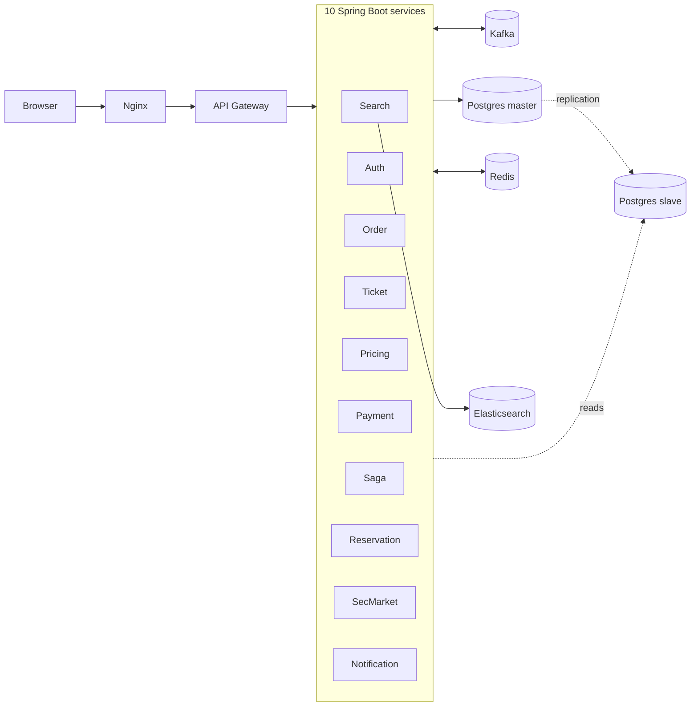

# Overture — Event Ticketing Platform

Microservice ticketing system — Java 21 + Spring Boot 3.2 + Kafka + Redis + Postgres.

## Prerequisites

| Tool           | Version |
| -------------- | ------- |
| Java           | 21+     |
| Maven          | 3.9+    |
| Docker         | 24+     |
| Docker Compose | 2.24+   |

## System architecture

Four-tier topology. Browser → nginx (edge) → API gateway (auth + circuit-breaker + rate-limit) →
ten Spring Boot services that communicate **only via Kafka** (no service-to-service HTTP for
business workflows) → shared Postgres + Redis + Elasticsearch storage.


```mermaid
flowchart LR
    Browser[Browser] --> Nginx
    Nginx --> Gateway[API Gateway]
    Gateway --> Services
    Services <--> Kafka[(Kafka)]
    Services --> PgMaster[(Postgres master)]
    Services -.reads.-> PgSlave[(Postgres slave)]
    Services <--> Redis[(Redis)]
    S10 --> ES[(Elasticsearch)]
    PgMaster -.replication.-> PgSlave

    subgraph Services[" 10 Spring Boot services "]
        S1[Auth]
        S2[Order]
        S3[Ticket]
        S4[Pricing]
        S5[Payment]
        S6[Saga]
        S7[Reservation]
        S8[SecMarket]
        S9[Notification]
        S10[Search]
    end
```

The **search-service** is intentionally out of the order saga — it consumes
`event.search.indexed` from Kafka and projects events into a read-only
Elasticsearch index. Postgres remains the source of truth; if ES or search-service
is down the rest of the platform keeps working.

> ▶️ **[Animated saga flows](https://htmlpreview.github.io/?https://github.com/xol60/ticketing-platform/blob/main/docs/animated-flows.html)** — interactive play/pause/step demo of all three scenarios.
> 📄 **[Static reference](https://htmlpreview.github.io/?https://github.com/xol60/ticketing-platform/blob/main/docs/diagrams.html)** — scroll-through version for readers who prefer text + step lists.

Key properties:

- **No HTTP between services for business workflows** → a downed service degrades into consumer
  lag, not cascading 5xx.
- **9 logical Postgres DBs on one master** → bounded-context isolation without paying for 9 clusters.
- **Redis is acceleration, not source of truth** → saga state writes Postgres first; Redis outage
  causes slow reads, not data loss.

## Project structure

```
ticketing-platform/
├── common-lib/              # Shared events, DTOs, exceptions
├── api-gateway/             # Reactive gateway — traceId, rate limiter, circuit breaker, auth cache
├── auth-service/            # JWT issue + refresh
├── ticket-service/          # Aggregate root, inventory lock
├── order-service/           # Workflow orchestrator
├── saga-orchestrator/       # Distributed transaction middleware
├── pricing-service/         # Dynamic pricing + Redis pub/sub
├── reservation-service/     # Waitlist queue
├── payment-service/         # External payment + DLQ + admin alert
├── secondary-market-service/# Ticket resale
├── notification-service/    # Email / push
├── search-service/          # Elasticsearch read-only event search (multi-field + autocomplete + fuzzy)
├── tests/                   # Stress test + demo-data seeder (SQL + bash wrapper) — see tests/README.md
├── docs/                    # Animated saga flows + static reference
└── docker/
    ├── kafka/               # Topic creation script
    ├── postgres/            # Master config + slave init
    ├── redis/               # redis.conf
    └── nginx/               # nginx.conf
```

> 🧪 **Verifying the system under load**: see [`tests/README.md`](tests/README.md)
> for the concurrent-order stress test, what it validates, and the operational
> findings it surfaces (rate-limiter sensitivity, circuit-breaker default-config sensitivity,
> p99 saga latency under payment retry).

## Quick start

### 1. Clone and configure

```bash
cp .env.example .env
# Generate a real JWT secret
openssl rand -base64 32
# Paste the output into .env as JWT_SECRET
```

### 2. Build all services

```bash
mvn clean package -DskipTests
```

### 3. Run (development)

Exposes all service ports locally and enables DEBUG logging + JVM remote debug on each service:

```bash
docker-compose -f docker-compose.yml -f docker-compose.dev.yml up --build
```

Remote debug ports: `508{1-9}` — e.g. auth-service → `5081`, ticket-service → `5082`.

### 4. Run (production)

Adds `restart: always`, memory/CPU limits, and hides all ports except Nginx:80:

```bash
docker-compose -f docker-compose.yml -f docker-compose.prod.yml up -d
```

### 5. Run (bare / default)

```bash
docker-compose up --build
```

### 6. Verify health

```bash
# Gateway (via nginx)
curl http://localhost/actuator/health

# Direct service ports (dev mode only)
curl http://localhost:8082/actuator/health   # ticket-service
curl http://localhost:8083/actuator/health   # order-service
```

## Development workflow

### Run a single service locally against Docker infra

```bash
# Start infra only
docker-compose up postgres-master redis kafka kafka-init -d

# Run any service with the 'local' profile (uses localhost ports)
cd ticket-service
mvn spring-boot:run -Dspring-boot.run.profiles=local
```

### Rebuild one service without restarting everything

```bash
docker-compose up --build --no-deps ticket-service
```

## Service ports (internal Docker network)

| Service              | Port                           |
| -------------------- | ------------------------------ |
| Nginx (public)       | 80                             |
| API Gateway          | 8090                           |
| Auth Service         | 8081                           |
| Ticket Service       | 8082                           |
| Order Service        | 8083                           |
| Saga Orchestrator    | 8084                           |
| Pricing Service      | 8085                           |
| Reservation Service  | 8086                           |
| Payment Service      | 8087                           |
| Secondary Market     | 8088                           |
| Notification Service | 8089                           |
| Search Service       | 8091                           |
| Postgres Master      | 5432 (internal) / 5436 (host)  |
| Redis                | 6379                           |
| Kafka                | 9092 (internal) / 29092 (host) |
| Elasticsearch        | 9200 (internal)                |

## Kafka topics

26 topics in total. Saga-flow topics use **10 partitions** by default, with the
partition key chosen so messages that need ordering land on the same partition
(usually `orderId`, sometimes `eventId` or `ticketId`). Two topics keep
**1 partition** intentionally (`payment.dlq`, `auth.security.alert`) so DLQ
replay and security forensics get strict global ordering.

**Consumer concurrency is set per `@KafkaListener`, not per service.** One
listener bumps to 10 threads because it's the single hottest consumer in
the system; everything else stays at the default of 3 threads per listener:

| Listener | Concurrency | Partitions each thread owns |
| -------- | ----------- | --------------------------- |
| `ticket-service` on `ticket.cmd` (the hot consumer) | **10** | Exactly 1 — one thread per partition for maximum parallelism on the saga's hot path |
| Every other `@KafkaListener` in the system | **3** | ~3-4 each — handles lower per-listener volume on a 10-partition topic |

Total consumer thread counts per service therefore depend on how many
listeners each service has (saga-orchestrator alone hosts 11 listeners ×
3 threads = 33 total). The *single* place we depart from "3 per listener"
is the `ticket.cmd` consumer.

See [Consumer concurrency and stalls — the slow-lane design](#consumer-concurrency-and-stalls--the-slow-lane-design) below for why this one exception, and what happens when a thread stalls.

### Unified command topics — the key ordering decision

`ticket-service` and `payment-service` each accept **multiple command types on one
topic** instead of one topic per command:

| Service         | Unified topic | Carries                                                                |
| --------------- | ------------- | ---------------------------------------------------------------------- |
| ticket-service  | `ticket.cmd`  | `TicketReserveCommand`, `TicketConfirmCommand`, `TicketReleaseCommand` |
| payment-service | `payment.cmd` | `PaymentChargeCommand`, `PaymentCancelCommand`                         |

If `Release` and `Confirm` lived on separate topics, two consumer threads could pick
them up concurrently — `Release` winning the race would emit a spurious
`TicketReservationFailed`. The payment analogue is worse: a `Cancel` processed before
its preceding `Charge` would silently drop, leaving the customer charged. Unified
topics + `orderId` partition key guarantee strict per-order ordering without any
application-level locking.

### Catalog (consolidated)

| Domain      | Topic                   | Producers               | Consumers (`@KafkaListener`) | Carries (event/command DTOs)                   | P     | C      | Key      |
| ----------- | ----------------------- | ----------------------- | ---------------------------- | ---------------------------------------------- | ----- | ------ | -------- |
| Order       | `order.created`         | order, secondary-market | saga                         | `OrderCreatedEvent`                            | 10    | 3      | orderId  |
| Order       | `order.confirmed`       | saga                    | order, reservation           | `OrderConfirmedEvent`                          | 10    | 3      | orderId  |
| Order       | `order.failed`          | saga                    | order                        | `OrderFailedEvent`                             | 10    | 3      | orderId  |
| Order       | `order.cancelled`       | saga                    | order                        | `OrderCancelledEvent`                          | 10    | 3      | orderId  |
| Order       | `order.price.changed`   | saga                    | order                        | `OrderPriceChangedEvent`                       | 10    | 3      | orderId  |
| Order       | `order.price.confirm`   | order                   | saga                         | `OrderPriceConfirmCommand`                     | 10    | 3      | orderId  |
| Order       | `order.price.cancel`    | order                   | saga                         | `OrderPriceCancelCommand`                      | 10    | 3      | orderId  |
| Ticket      | **`ticket.cmd`**        | saga                    | ticket                       | `Reserve` / `Confirm` / `Release` Command      | 10    | **10** | orderId  |
| Ticket      | `ticket.reserved`       | ticket                  | saga, pricing                | `TicketReservedEvent`                          | 10    | 3      | orderId  |
| Ticket      | `ticket.released`       | ticket                  | saga, reservation, pricing   | `TicketReleasedEvent`                          | 10    | 3      | orderId  |
| Ticket      | `ticket.confirmed`      | ticket                  | saga, notification           | `TicketConfirmedEvent`                         | 10    | 3      | orderId  |
| Pricing     | `pricing.lock.cmd`      | saga                    | pricing                      | `PriceLockCommand`                             | 10    | 3      | orderId  |
| Pricing     | `pricing.locked`        | pricing                 | saga                         | `PricingLockedEvent`                           | 10    | 3      | orderId  |
| Pricing     | `pricing.price.changed` | pricing                 | saga                         | `PriceChangedEvent`                            | 10    | 3      | orderId  |
| Pricing     | `pricing.failed`        | pricing                 | saga                         | `PricingFailedEvent`                           | 10    | 3      | orderId  |
| Pricing     | `price.updated`         | pricing                 | _(SSE fan-out, no listener)_ | `PriceUpdatedEvent`                            | 10    | —      | eventId  |
| Payment     | **`payment.cmd`**       | saga                    | payment                      | `Charge` / `Cancel` Command                    | 10    | 3      | orderId  |
| Payment     | `payment.succeeded`     | payment                 | saga                         | `PaymentSucceededEvent`                        | 10    | 3      | orderId  |
| Payment     | `payment.failed`        | payment                 | saga                         | `PaymentFailedEvent`                           | 10    | 3      | orderId  |
| Payment     | `payment.refunded`      | payment                 | _(none — fan-out)_           | `PaymentRefundedEvent`                         | 10    | —      | orderId  |
| Payment     | `payment.dlq`           | payment                 | notification                 | `PaymentFailedEvent` (after retries exhausted) | **1** | 3      | orderId  |
| Reservation | `reservation.promoted`  | reservation             | _(none — fan-out)_           | `ReservationPromotedEvent`                     | 10    | —      | ticketId |
| Event mgmt  | `event.status.changed`  | ticket                  | _(none — fan-out)_           | `EventStatusChangedEvent`                      | 10    | —      | eventId  |
| Event mgmt  | `event.search.indexed`  | ticket                  | search                       | `EventSearchIndexedEvent`                      | 10    | 3      | eventId  |
| Notif       | `notification.send`     | any service             | notification                 | `NotificationSendCommand`                      | 10    | 3      | orderId  |
| Security    | `auth.security.alert`   | auth                    | notification                 | `AuthSecurityAlertEvent`                       | **1** | 3      | userId   |

**P** = partitions. **C** = per-listener consumer concurrency. `payment.dlq`
and `auth.security.alert` keep 1 partition for strict global ordering
(chronological DLQ replay and security forensics). The C column shows the
deliberate exception: `ticket.cmd` is the one consumer bumped to 10 threads
(one per partition) because it's the hot path of every saga; everywhere else
the default 3 is enough. Topics with `—` are produced but have no
`@KafkaListener` consumer today (fan-out / future-subscribers / pulled via
SSE) — see notes below.

**Why some topics have no listener:**
- `price.updated`: pulled by clients via the SSE stream at `/api/pricing/stream/**`,
  not consumed by any service.
- `payment.refunded`: emitted as a notification-style fact; the saga has
  already advanced to compensation by the time refunds happen, and the
  refund itself is observable via `payment.dlq` if it fails.
- `reservation.promoted`: emitted as a fact; the waitlist promotion is
  visible through the order's own state transitions.
- `event.status.changed`: kept as a separate topic so future subscribers
  (analytics, audit, indexers) can opt in without ticket-service knowing
  about them. The search-service uses the related `event.search.indexed`
  topic instead.

## Order placement — saga flows

Three end-to-end flows triggered by `POST /api/orders`, all sharing the first four hops
and diverging at the **pricing-lock** step.

> ▶️ **[Animated saga flows](https://htmlpreview.github.io/?https://github.com/xol60/ticketing-platform/blob/main/docs/animated-flows.html)** — interactive play/pause/step demo.
> 📄 **[Static reference](https://htmlpreview.github.io/?https://github.com/xol60/ticketing-platform/blob/main/docs/diagrams.html)** — scroll-through HTML version.


```mermaid
flowchart LR
    Start([POST /api/orders]) --> Reserve[Reserve ticket]
    Reserve --> Lock{Pricing lock}
    Lock -->|Case B: exact match| Pay[Charge payment]
    Lock -->|Case C: surge moved| Wait[AWAITING_PRICE_CONFIRMATION<br/>30s window]
    Wait -->|user confirms| Pay
    Wait -->|user cancels<br/>or watchdog timeout| Comp[Release ticket lock]
    Pay --> Confirm[Confirm ticket]
    Confirm --> Done([COMPLETED])
    Comp --> Cancel([CANCELLED])
```

| Flow                          | Divergence rule                                      | Saga      | Order     | Ticket    | Payment       |
| ----------------------------- | ---------------------------------------------------- | --------- | --------- | --------- | ------------- |
| **1 — Happy path**            | `userPrice == facePrice × multiplierAtOrderTime`     | COMPLETED | CONFIRMED | CONFIRMED | SUCCESS       |
| **2 — Accept new price**      | Case C → user POSTs `/confirm-price`                 | COMPLETED | CONFIRMED | CONFIRMED | SUCCESS (new) |
| **3 — Decline / 30s timeout** | Case C → `/cancel-price` **or** SagaWatchdog expires | CANCELLED | CANCELLED | AVAILABLE | (none)        |

All three flows converge to a **fully consistent terminal state across 4 databases** —
no orphan rows, no half-charged payments, no leaked ticket locks.

## Performance, scaling & state synchronization

### Throughput at a single-replica baseline

| Layer                      | Capacity              | Limited by                                |
| -------------------------- | --------------------- | ----------------------------------------- |
| Order API ingress          | ~2,000 req/s          | Nginx `limit_req` (200r/s/IP × keepalive) |
| Kafka consumer (per listener) | ~600 msg/s @ concurrency=3; ~2,000 msg/s on `ticket.cmd` @ concurrency=10 | threads × ~5 ms DB tx |
| End-to-end saga (10 hops)  | < 1s p50, < 2s p99    | Race-test measured                        |
| Payment retry watchdog     | 50 payments / 2s tick | `BATCH_SIZE=50`, `fixedDelay=2s`          |
| SSE connections per pod    | ~10,000               | Nginx `worker_connections × cores`        |

### Where the bottleneck sits

```
Redis read       <  1 ms
Kafka roundtrip  1–2 ms
DB transaction   5–15 ms     ← actual bottleneck
Payment gateway  50–200 ms   ← OFFLOADED to watchdog, off consumer thread
```

Originally bottlenecked at the payment gateway because `gateway.charge() + Thread.sleep()`
ran on the Kafka consumer thread, freezing the partition. Refactored to a claim-lease
pattern in [`PaymentRetryWatchdog`](payment-service/src/main/java/com/ticketing/payment/watchdog/PaymentRetryWatchdog.java) —
consumer throughput jumped from ~15 → ~300 msg/s per partition.

### Horizontal scaling — pure ops, no code change

Every service is **stateless at the JVM level** (state lives in Postgres / Redis / Kafka),
so adding replicas is a Kafka rebalance:

| Action         | How                                                                 | Effect                                |
| -------------- | ------------------------------------------------------------------- | ------------------------------------- |
| Scale-out (HA) | `docker compose up -d --scale ticket-service=3`                     | Same throughput, 2-pod loss tolerance |
| Scale-up (TPS) | Bump partitions in `create-topics.sh` (idempotent), then scale pods | Linear up to partition count          |
| More DB reads  | Add a second `postgres-slave` + update routing                      | 2× read QPS                           |
| More Redis ops | Switch to Redis cluster (3 master + 3 replica)                      | 100k → 1M ops/s                       |

**Hard constraint:** `partitions ≥ total_consumer_threads` per service. The
`ensure_partitions` helper in `create-topics.sh` is idempotent so bumps don't require redeploy.

### Cross-instance synchronization

Two pods consuming different partitions can race on the same `orderId` or the same DB row.
Every such race closes at a **durable boundary** — DB, Kafka, or Redis. **All mechanisms
are non-blocking** — no `SELECT … FOR UPDATE`, no app-level `synchronized` blocks. Both
would tie up Kafka consumer threads, and per-listener thread counts are sized tight
(3 per listener everywhere, 10 on the one hot `ticket.cmd` listener), so a parked
thread is a visible loss of capacity on that listener's topic.

| Mechanism                             | Closes which race                                       |
| ------------------------------------- | ------------------------------------------------------- |
| Redis `SETNX` distributed lock        | Two pods racing to reserve the same ticket; two pods promoting the same waitlist head |
| Optimistic `@Version` on entities     | Belt-and-suspenders: catches concurrent UPDATE if Redis fails or its TTL expires mid-flight |
| UNIQUE partial index                  | DB-level overselling / double-listing                   |
| Kafka consumer-group assignment       | Two pods consuming the same partition (broker enforced) |
| `orderId` partition key               | `Release` overtaking `Reserve` across pods              |
| Claim-lease (`nextRetryAt` window)    | Two payment pods double-charging the same payment       |
| Write-through saga state (PG → Redis) | Lost progress on Redis flush or pod restart             |
| Idempotency (sagaId / payment state)  | Duplicate processing on Kafka redelivery                |

### Ticket reservation — two-layer non-blocking locking

The ticket-service uses **Redis SETNX + JPA `@Version` optimistic locking**, deliberately
avoiding `SELECT … FOR UPDATE`. The consumer pool is 10 threads (one per partition on
`ticket.cmd`); a single pessimistic-lock waiter would tie up 10% of capacity until the
DB released the row.

```
Layer 1 — Redis SETNX (fast path)
  ├─ 99% of contention rejections close here in <1 ms
  ├─ Never blocks the consumer thread — returns boolean
  └─ Loser publishes TICKET_LOCK_CONFLICT and returns

Layer 2 — @Version optimistic (safety net)
  ├─ Catches edge cases where Redis is down or its key expired mid-flight
  ├─ Never blocks — fails at SQL execution in microseconds
  └─ Catches OptimisticLockingFailureException → publishes TICKET_UNAVAILABLE
```

`handleReserveCommand`, `handleConfirmCommand`, and `releaseTicket` all use this pattern:
`findById` (no lock) → mutate → `saveAndFlush` → catch `OptimisticLockingFailureException`
→ publish the appropriate compensation event.

### Consumer concurrency and stalls — the slow-lane design

A common question: with `concurrency=3` on the typical listener, doesn't a
single stuck thread (waiting on Postgres, GC pause, network hang) drop that
listener to 66 % throughput? Yes — and that's the intended shape of the
failure mode, not a defect. The choice is deliberate; here's the reasoning.

**Concurrency is per `@KafkaListener`, not per service.** Each annotated
listener gets its own container, and the container factory's concurrency
setting applies to each container independently. So saga-orchestrator's 11
listeners × 3 threads = 33 total consumer threads, but each individual
listener is still a 3-thread pool. A thread stuck inside the
`TICKET_RESERVED` listener costs 1/3 of *that listener's* throughput; the
adjacent `PAYMENT_SUCCEEDED` listener (different container, different
threads) keeps going at full rate.

**Why `concurrency` ≈ partition count.** Kafka's unit of parallelism is
the partition: within one consumer group, at most one thread reads from a
given partition at any moment. So the per-listener thread count caps
parallelism at the partition count; adding more threads beyond that gives
idle threads (Kafka won't assign two threads to the same partition). The
thread-per-partition pinning is also what gives us the per-`orderId`
ordering guarantee the whole saga is built on — without it, a `Release`
could overtake a `Reserve` for the same order across pods.

**Why one listener (`ticket.cmd`) bumps to 10 and everything else stays at 3.**
`ticket.cmd` is the hot path: every order goes through it three times
(Reserve / Confirm / Release), it's the most contended topic, and a stall
there visibly slows checkout. We give it one thread per partition (10 of
10) so each partition has dedicated capacity. Every other listener handles
lower per-listener volume; 3 threads each owning ~3-4 partitions of a
10-partition topic is enough headroom, and over-provisioning consumer
threads wastes memory and connection-pool slots that better serve
user-facing requests.

**What "stuck" actually does.** When one thread of a 3-thread listener
stalls:

| Effect | What happens |
| ------ | ------------ |
| The ~3-4 partitions assigned to that thread | Stop being processed entirely |
| The other ~6-7 partitions on the other threads of the same listener | Keep flowing at full rate |
| That listener's throughput | Drops to roughly 2/3 of nominal |
| Consumer lag | Builds monotonically on the stuck partitions of that one topic |
| Other `@KafkaListener`s on the same service | Unaffected — they're separate containers with separate threads |
| Other services / the user-facing POST | Unaffected |

It's a deterministic, scoped degradation — a **slow lane**, not a full
outage. Roughly 1/3 of messages on one topic queue while the other 2/3
ship normally, and adjacent topics on the same service stay green. The
user-facing `POST /api/orders` doesn't move because the saga is async
under it; the symptom surfaces as "my order is PENDING for longer than
usual" on the tracker page.

**Why a stuck thread can't cascade into a full outage.** Five properties
combine so the 66% drop is the worst case, not a death-spiral precursor:

1. **Tight transactional scope.** Handlers use `TransactionTemplate` around
   the actual UPDATE, not `@Transactional` on the whole method. The DB
   connection is checked out for ~5 ms per message, so the consumer pool
   can't exhaust the connection pool from contention.
2. **Non-blocking concurrency primitives.** SETNX + `@Version` instead of
   `SELECT … FOR UPDATE`. Application-level hot-row contention cannot park
   a thread — the only way to stick a thread is genuine infrastructure
   trouble (network hang, GC pause).
3. **`next_retry_at` for slow downstreams.** Payment retries don't sit on
   the consumer thread waiting for backoff. The handler stores
   `status=PENDING_RETRY, next_retry_at=now+backoff`, acks the message, and
   a `@Scheduled` job picks the retry up later on its own threadpool.
4. **DLQ on retry exhaustion.** When payment retries run out, the message
   moves to `payment.dlq` for human inspection. The consumer doesn't loop
   forever on a permanently broken message.
5. **Watchdogs as the time bound.** Even if a saga genuinely wedges, the
   stuck-reservation watchdog releases the ticket within 60-120 s, so the
   stall is bounded in *time* rather than just *space*.

**When you'd diverge from this design.** Three signals would push toward
something different:

| Signal | What to do |
| ------ | ---------- |
| Lag grows during normal load (not stalls) | Bump partition count + consumer concurrency; the cheapest scale knob |
| Handler genuinely needs to wait on slow I/O | Reactive consumer (`reactor-kafka`) so one thread handles many in-flight messages; cost is reactive-everywhere |
| Single hot key creates partition skew | Add a sharding suffix to the key; cost is losing strict per-original-key ordering |

Nothing in the current load profile triggers any of those. The 66% drop on
a stalled thread is acceptable because it's bounded, visible (lag metric
spikes on one partition), and recoverable — the slow-lane shape we
designed for.

## Search subsystem

A dedicated `search-service` exposes two public REST endpoints backed by an
Elasticsearch derived index. It is deliberately **outside** the order saga —
Postgres remains the source of truth, ES is only a derived view of `OPEN`
events, and a search-service outage degrades discovery without affecting
ticket sales.

### Indexing pipeline

```
ticket-service              Kafka                 search-service        Elasticsearch
─────────────────           ─────────────────     ──────────────────    ──────────────
EventService                event.search.indexed  EventIndexConsumer    events index
  ├─ createEvent      ──▶   (10 partitions,       ├─ OPEN  → save()  ──▶ PUT _doc/{id}
  ├─ updateEvent      ──▶    keyed by eventId)    └─ else  → delete()──▶ DELETE _doc/{id}
  └─ changeStatus     ──▶
```

Manual-ack consumer + idempotent `save()` / `deleteById()` make Kafka redelivery
safe. Keying by `eventId` keeps per-event updates serialized within a partition —
no risk of a stale upsert overtaking a later delete.

### Three features that justify ES

| Feature                    | Mechanism                                                                                   |
| -------------------------- | ------------------------------------------------------------------------------------------- |
| Multi-field full-text + boost | `multi_match` over six fields: `name^3.0`, `primaryArtist^2.5`, `venueName^1.5`, `venueCity^1.0`, `shortDescription^0.8`, `fullDescription^0.4` |
| Fuzzy matching             | `fuzziness=AUTO` — 1 edit for 3-5 chars, 2 edits for 6+ chars (e.g. `coldlpay` → Coldplay)  |
| Autocomplete-as-you-type   | `name.edge` sub-field with custom `edge_ngram_analyzer` (min_gram=2, max_gram=20)           |

### Endpoints

```
GET /api/search/events?q={query}&category=CONCERT&genre=POP&from=0&size=20
   → EventSearchPage { query, totalHits, from, size, hits[] }

GET /api/search/events/suggest?q={prefix}&size=5
   → List<AutocompleteSuggestion> { eventId, text, primaryArtist }
```

Both endpoints are public (no auth) and capped server-side (`size` ≤ 100 for
search, ≤ 10 for suggest). The hard filter `status = OPEN` is applied at the
query layer as defense-in-depth — the indexer also removes non-OPEN events.

### Load-shaping for /suggest

Autocomplete is naturally bursty: a single typist fires several requests per
second, and many users hit hot prefixes (`co`, `col`, …) simultaneously.
Four layers cooperate to keep ES from being hammered:

- **UI debounce (300 ms)** and **`AbortSignal` cancellation** of in-flight
  requests on each new keystroke. Stops "c → co → col" from leaving three
  parallel ES queries open at the gateway.
- **React Query `staleTime: 60 s`** on the suggest cache key — back-spacing
  and re-typing the same prefix is a free in-memory hit.
- **Gateway per-path rate-limit override** for `/api/search/*` (60 r/s vs
  the default 20 r/s) — autocomplete-friendly, still well below nginx's
  200 r/s per-IP ceiling.
- **Caffeine `search-suggest` cache in search-service** (TTL 60 s, 50 000
  entries, default W-TinyLFU eviction). Two SpEL guards keep it clean:
  - `key = normalise(prefix)` — lowercases + trims + collapses whitespace,
    so `"Co"`, `"co"`, `"  CO  "` all share one entry.
  - `condition = cacheable(prefix)` — admission filter rejecting prefixes
    that are too short, too long, or have no letters (pure-digit / pure-
    punctuation inputs bypass the cache entirely, so they can't pollute it).

`EventIndexConsumer` calls `cache.invalidate()` after every successful ES
write — so users see edits within Kafka latency (~1–2 s), not after the
60 s TTL. Measured outcome: in a 30-call replay across 6 hot prefixes,
only **1** request reached Elasticsearch (~30× reduction).

The full search endpoint (`/api/search/events`) is deliberately **not**
cached. Free-text queries plus paging + facets give every key high
cardinality and low reuse, so caching them would pollute the table
without measurably reducing load. The gateway rate-limit + client debounce
are sufficient there.

### Explicitly out of scope

- Geo "near me" / radius queries (needs lat/lng and map provider)
- Multilingual / Vietnamese tokenisation (needs ICU analyzer + synonyms)
- Popularity / click-through-rate ranking (needs separate event-tracking)
- Aggregations / faceted counts (basic filter params only)
- Bulk reindex job (deferred — Postgres can rebuild via republish if needed)

## Request idempotency — defence in depth

Mutating POST endpoints (`POST /api/orders`, `POST /api/secondary/listings`)
are protected by a three-tier stack. Each tier catches a different failure
mode; if one is bypassed, the next still catches the duplicate.

### Tier 1 — UI: keep the duplicate intent in the browser

- **Button disabled while the mutation is pending.** React Query's
  `useMutation` flips the Buy / List button to disabled the instant the
  user clicks, and re-enables on settle. Catches the same-tab same-second
  double-click.
- **Buy-button gating on existing orders.** `EventDetailPage` indexes the
  user's orders by `ticketId`; any non-terminal order (`PENDING` /
  `PRICE_CHANGED` / `CONFIRMED`) renders "⏳ In progress" or "✓ Owned"
  instead of "Buy". Catches cross-tab clicks, returns-to-the-page-then-
  click, refresh-then-retry.
- **Client-generated `Idempotency-Key` (UUIDv4) per click.** Same key reused
  across React Query's auto-retries. Alone it catches nothing — it's the
  pairing with Tier 2 that makes network retries safe.

### Tier 2 — HTTP boundary: Stripe-pattern dedup

`common-lib/idempotency/IdempotencyFilter` opt-in per service via
`idempotency.enabled: true` + `idempotency.paths: [...]`:

```
on POST {configured path}:
  read Idempotency-Key header
  read X-User-Id (injected by gateway)
  hash request body with SHA-256
  redis: GET idem:{userId}:{key}
    miss               → run controller, cache 2xx response for 24 h
    hit, same hash     → REPLAY cached response (controller never runs)
    hit, different hash → 422 IDEMPOTENCY_KEY_REUSED
  redis throws         → log + pass through (fail-open)
```

- Failures (non-2xx) are deliberately **not** cached — a transient outage
  shouldn't latch a failure response for 24 h.
- Per-user scope on the dedup key makes cross-user collision attacks
  impossible — a malicious key can only collide with the attacker's own.
- 9 unit tests in `common-lib` cover hit, miss, 422, failure-not-cached,
  fail-open, GET-bypass, unconfigured-path bypass, missing-key, missing-user.

### Tier 3 — Async / saga / DB: the safety net

If a duplicate slips past Tier 1 and 2 (e.g. DevTools-crafted retry with a
fresh UUID), the existing saga safety nets still catch it:

- **`orderId`-keyed Kafka partitioning** keeps per-order commands sequential.
- **Redis `SETNX` on `ticket:lock:{ticketId}`** sub-millisecond-fails a
  second saga trying to reserve the same ticket.
- **Status-and-owner idempotency** in `handleReserveCommand` /
  `handleConfirmCommand` handles Kafka redelivery: if the ticket is already
  in the expected state owned by this order, the handler republishes the
  prior success event instead of re-processing.
- **JPA optimistic locking (`@Version`)** catches any race that bypassed
  Redis (Redis outage, lock TTL expired mid-flight, direct SQL).
- **Hybrid transactional outbox** ensures a Kafka publish failure during a
  write tx doesn't lose the event — it's persisted in DB and retried.
- **Stuck-reservation watchdog** (every 60 s) releases `RESERVED` tickets
  past their `reservedUntil` deadline so a saga that crashed mid-flow
  doesn't lock the ticket forever.

### Verified outcome

Sending three POSTs of the same intent — two with the same Idempotency-Key
and one with a different body — yields:

| POST | Status | Result |
|------|--------|--------|
| #1, key X, body A | 201 | New order O created |
| #2, key X, body A | 201 | **Replay** — same orderId, same traceId, controller never runs |
| #3, key X, body B | 422 | `IDEMPOTENCY_KEY_REUSED` |

DB count for `(userId, ticketId)`: **exactly one row**.

## Architecture decisions

### Auth — gateway-only, internal trust model

JWT is validated once at the API Gateway using a two-layer cache (L1 in-process LRU + L2 Redis).
Internal services receive `X-User-Id`, `X-User-Role`, `X-Trace-Id` headers — no JWT re-validation.
Internal services are network-isolated: only reachable from within the Docker network.

Two path categories bypass auth:
- **`publicPaths`** (all HTTP methods) — `/api/auth/login`, `/api/auth/register`,
  `/api/auth/refresh`, `/actuator/health`.
- **`publicGetPaths`** (GET only) — `/api/tickets/events`, `/api/tickets`,
  `/api/search/`, `/api/secondary/listings`, `/api/pricing/rules`. The
  method-aware check means anonymous users can browse the catalog and
  search results, while the corresponding POST / PATCH / DELETE on the
  same prefix still require a token. Implemented in `AuthFilter` by checking
  `HttpMethod.GET == request.getMethod()` before the public-GET prefix match.

### Saga — orchestration pattern

The `saga-orchestrator` drives each transaction step explicitly via Kafka commands.
State is persisted in Redis (`saga:{sagaId}`) with TTL-based watchdog for stuck sagas.
Compensation runs in reverse order on any step failure.

### Database — master/slave read routing

All writes go to `postgres-master`. Reads follow: L1 cache → L2 Redis → postgres-slave.
Each service has its own database (bounded context isolation — no cross-service SQL).

### Circuit breaker + rate limiter — gateway only

Resilience4j circuit breaker wraps each upstream service independently.
Rate limiter uses Redis sliding window counters keyed by `IP:userId`.

Per-path overrides via `gateway.rate-limit.path-overrides`:

| Path prefix     | Limit (r/s) | Why |
| --------------- | ----------- | --- |
| `/api/auth`     | 5           | Tighter on login / refresh — credential-stuffing surface |
| `/api/search`   | 60          | Autocomplete-as-you-type is naturally bursty; anonymous users from one NAT IP share the bucket. Higher limit safe because the search-service Caffeine cache already protects ES. |
| (default)       | 20          | Everything else |
