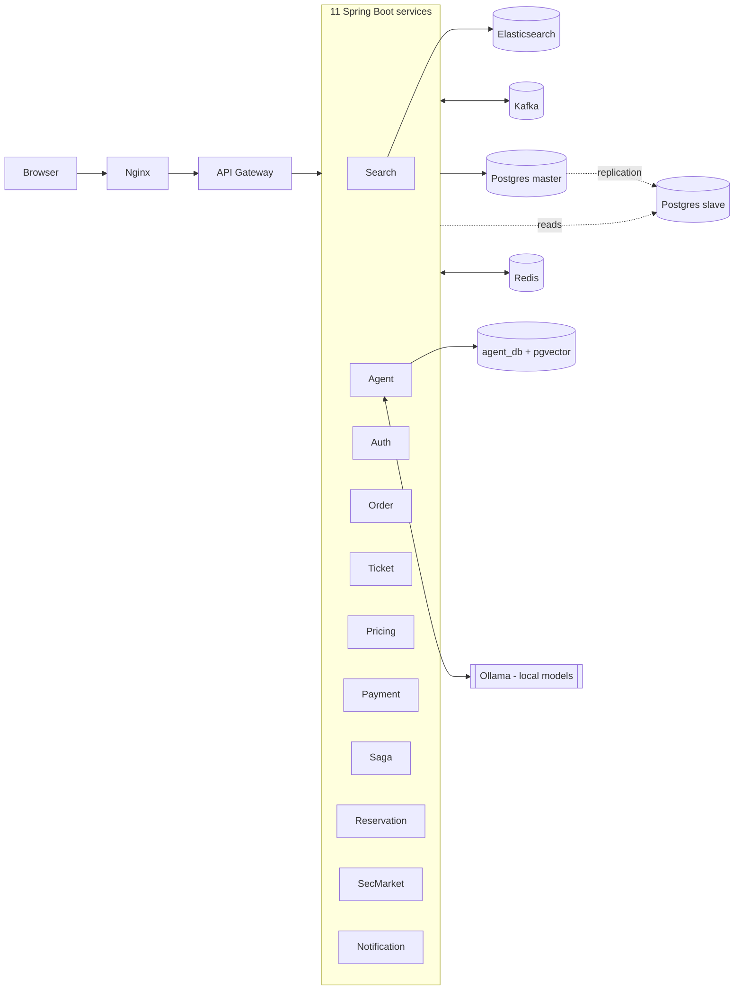

# Overture — Event Ticketing Platform

Microservice ticketing system — Java 21 + Spring Boot 3.2 + Kafka + Redis + Postgres,
with a **conversational recommendation agent running entirely on local models**.

Two things here are worth more attention than the service count:

- **A saga that survives partial failure.** Reserve → price lock → payment → confirm,
  with compensation, idempotency at every hop, and no service-to-service HTTP in any
  business workflow.
- **An agent built on the assumption that its model lies.** Inference runs on
  `qwen3:8b` in Ollama — no API key, no data leaving the machine — and an 8B model
  fabricates readily and *fluently*. Every fact it produces has to quote the sentence
  it came from, and is thrown away if that sentence is not there.

▶︎ **[Recommendation agent](#recommendation-agent)** — flow, models, hard limits, and
what the measurements actually say.

## Prerequisites

| Tool           | Version |
| -------------- | ------- |
| Java           | 21+     |
| Maven          | 3.9+    |
| Docker         | 24+     |
| Docker Compose | 2.24+   |

## System architecture

Four-tier topology. Browser → nginx (edge) → API gateway (auth + circuit-breaker + rate-limit) →
eleven Spring Boot services that communicate **only via Kafka** (no service-to-service HTTP for
business workflows) → shared Postgres + Redis + Elasticsearch storage, plus a local Ollama
runtime used by the recommendation agent.


```mermaid
flowchart LR
    Browser[Browser] --> Nginx
    Nginx --> Gateway[API Gateway]
    Gateway --> Services
    Services <--> Kafka[(Kafka)]
    Services --> PgMaster[(Postgres master)]
    Services -.reads.-> PgSlave[(Postgres slave)]
    Services <--> Redis[(Redis)]
    S10 --> ES[(Elasticsearch)]
    S11 --> PgVec[(agent_db + pgvector)]
    S11 <--> Ollama[[Ollama - local models]]
    PgMaster -.replication.-> PgSlave

    subgraph Services[" 11 Spring Boot services "]
        S1[Auth]
        S2[Order]
        S3[Ticket]
        S4[Pricing]
        S5[Payment]
        S6[Saga]
        S7[Reservation]
        S8[SecMarket]
        S9[Notification]
        S10[Search]
        S11[Agent]
    end
```

Two services sit outside the order saga, both as read models off the same
`event.search.indexed` topic and neither aware of the other:

- **search-service** projects events into a read-only Elasticsearch index for
  keyword search.
- **agent-service** projects them into Postgres + pgvector for the conversational
  recommendation agent.

Postgres remains the source of truth for both. If either is down — or Ollama is
not running — the rest of the platform keeps selling tickets.

> ▶️ **[Animated saga flows](https://htmlpreview.github.io/?https://github.com/xol60/ticketing-platform/blob/main/docs/animated-flows.html)** — interactive play/pause/step demo of all three scenarios.
> 📄 **[Static reference](https://htmlpreview.github.io/?https://github.com/xol60/ticketing-platform/blob/main/docs/diagrams.html)** — scroll-through version for readers who prefer text + step lists.

Key properties:

- **No HTTP between services for business workflows** → a downed service degrades into consumer
  lag, not cascading 5xx.
- **9 logical Postgres DBs on one master** → bounded-context isolation without paying for 9 clusters.
- **Redis is acceleration, not source of truth** → saga state writes Postgres first; Redis outage
  causes slow reads, not data loss.

## Project structure

Each service has its own README with API, internal architecture, and operational notes.

| Path | Headline |
| ---- | -------- |
| [`common-lib/`](common-lib)                                       | Shared events, DTOs, exceptions, the Stripe-pattern idempotency filter |
| [`api-gateway/`](api-gateway)                                     | Reactive gateway — traceId, rate limiter, circuit breaker, auth cache  |
| [`auth-service/`](auth-service)                                   | JWT issue + refresh                                                    |
| [`ticket-service/`](ticket-service)                               | Aggregate root, inventory lock, hot consumer at `concurrency=10`       |
| [`order-service/`](order-service)                                 | Workflow orchestrator + HTTP idempotency on `POST /api/orders`         |
| [`saga-orchestrator/`](saga-orchestrator)                         | Distributed transaction middleware, 11 saga listeners                  |
| [`pricing-service/`](pricing-service)                             | Dynamic surge pricing with point-in-time validation                    |
| [`reservation-service/`](reservation-service)                     | Waitlist queue                                                         |
| [`payment-service/`](payment-service)                             | External payment + DLQ + admin alert + claim-lease retry watchdog      |
| [`secondary-market-service/`](secondary-market-service)           | Ticket resale + HTTP idempotency on `POST /api/secondary/listings`     |
| [`notification-service/`](notification-service)                   | Email / push                                                           |
| [`search-service/`](search-service)                               | Elasticsearch read-only event search — multi-field + autocomplete + fuzzy |
| [`agent-service/`](agent-service)                                 | Conversational recommendation agent — local LLM, pgvector, five validation gates |
| [`ticketing-ui/`](ticketing-ui)                                   | React + TypeScript SPA                                                 |
| [`tests/`](tests)                                                 | Concurrent-order stress test, demo-data seeder, agent retrieval + conversation evals |
| [`docs/`](docs)                                                   | Cross-cutting deep dives (see [Deep dives](#deep-dives) below)         |
| `docker/`                                                         | Topic-creation script, Postgres master+slave config, Redis & Nginx confs |

## Quick start

### 1. Clone and configure

```bash
cp .env.example .env
# Generate a real JWT secret
openssl rand -base64 32
# Paste the output into .env as JWT_SECRET
```

### 2. Build all services

```bash
mvn clean package -DskipTests
```

### 3. Run (development)

Exposes all service ports locally and enables DEBUG logging + JVM remote debug on each service:

```bash
docker-compose -f docker-compose.yml -f docker-compose.dev.yml up --build
```

Remote debug ports: `508{1-9}` — e.g. auth-service → `5081`, ticket-service → `5082`.

### 4. Run (production)

Adds `restart: always`, memory/CPU limits, and hides all ports except Nginx:80:

```bash
docker-compose -f docker-compose.yml -f docker-compose.prod.yml up -d
```

### 5. Run (bare / default)

```bash
docker-compose up --build
```

### 6. Verify health

```bash
# Gateway (via nginx)
curl http://localhost/actuator/health

# Direct service ports (dev mode only)
curl http://localhost:8082/actuator/health   # ticket-service
curl http://localhost:8083/actuator/health   # order-service
```

## Development workflow

### Run a single service locally against Docker infra

```bash
# Start infra only
docker-compose up postgres-master redis kafka kafka-init -d

# Run any service with the 'local' profile (uses localhost ports)
cd ticket-service
mvn spring-boot:run -Dspring-boot.run.profiles=local
```

### Rebuild one service without restarting everything

```bash
docker-compose up --build --no-deps ticket-service
```

## Service ports (internal Docker network)

| Service              | Port                           |
| -------------------- | ------------------------------ |
| Nginx (public)       | 80                             |
| API Gateway          | 8090                           |
| Auth Service         | 8081                           |
| Ticket Service       | 8082                           |
| Order Service        | 8083                           |
| Saga Orchestrator    | 8084                           |
| Pricing Service      | 8085                           |
| Reservation Service  | 8086                           |
| Payment Service      | 8087                           |
| Secondary Market     | 8088                           |
| Notification Service | 8089                           |
| Search Service       | 8091                           |
| Agent Service        | 8092                           |
| Postgres Master      | 5432 (internal) / 5436 (host)  |
| Redis                | 6379                           |
| Kafka                | 9092 (internal) / 29092 (host) |
| Elasticsearch        | 9200 (internal)                |
| Ollama               | 11434 (host, not containerised on macOS) |

## Kafka topics

27 topics in total. Saga-flow topics use **10 partitions** by default, with the
partition key chosen so messages that need ordering land on the same partition
(usually `orderId`, sometimes `eventId` or `ticketId`). Two topics keep
**1 partition** intentionally (`payment.dlq`, `auth.security.alert`) so DLQ
replay and security forensics get strict global ordering.

**Consumer concurrency is set per `@KafkaListener`, not per service.** One
listener bumps to 10 threads because it's the single hottest consumer in
the system; everything else stays at the default of 3 threads per listener:

| Listener | Concurrency | Partitions each thread owns |
| -------- | ----------- | --------------------------- |
| `ticket-service` on `ticket.cmd` (the hot consumer) | **10** | Exactly 1 — one thread per partition for maximum parallelism on the saga's hot path |
| Every other `@KafkaListener` in the system | **3** | ~3-4 each — handles lower per-listener volume on a 10-partition topic |

Total consumer thread counts per service therefore depend on how many
listeners each service has (saga-orchestrator alone hosts 11 listeners ×
3 threads = 33 total). The *single* place we depart from "3 per listener"
is the `ticket.cmd` consumer.

See [Consumer concurrency and stalls — the slow-lane design](#consumer-concurrency-and-stalls--the-slow-lane-design) below for why this one exception, and what happens when a thread stalls.

### Unified command topics — the key ordering decision

`ticket-service` and `payment-service` each accept **multiple command types on one
topic** instead of one topic per command:

| Service         | Unified topic | Carries                                                                |
| --------------- | ------------- | ---------------------------------------------------------------------- |
| ticket-service  | `ticket.cmd`  | `TicketReserveCommand`, `TicketConfirmCommand`, `TicketReleaseCommand` |
| payment-service | `payment.cmd` | `PaymentChargeCommand`, `PaymentCancelCommand`                         |

If `Release` and `Confirm` lived on separate topics, two consumer threads could pick
them up concurrently — `Release` winning the race would emit a spurious
`TicketReservationFailed`. The payment analogue is worse: a `Cancel` processed before
its preceding `Charge` would silently drop, leaving the customer charged. Unified
topics + `orderId` partition key guarantee strict per-order ordering without any
application-level locking.

### Catalog (consolidated)

| Domain      | Topic                   | Producers               | Consumers (`@KafkaListener`) | Carries (event/command DTOs)                   | P     | C      | Key      |
| ----------- | ----------------------- | ----------------------- | ---------------------------- | ---------------------------------------------- | ----- | ------ | -------- |
| Order       | `order.created`         | order, secondary-market | saga                         | `OrderCreatedEvent`                            | 10    | 3      | orderId  |
| Order       | `order.confirmed`       | saga                    | order, reservation           | `OrderConfirmedEvent`                          | 10    | 3      | orderId  |
| Order       | `order.failed`          | saga                    | order                        | `OrderFailedEvent`                             | 10    | 3      | orderId  |
| Order       | `order.cancelled`       | saga                    | order                        | `OrderCancelledEvent`                          | 10    | 3      | orderId  |
| Order       | `order.price.changed`   | saga                    | order                        | `OrderPriceChangedEvent`                       | 10    | 3      | orderId  |
| Order       | `order.price.confirm`   | order                   | saga                         | `OrderPriceConfirmCommand`                     | 10    | 3      | orderId  |
| Order       | `order.price.cancel`    | order                   | saga                         | `OrderPriceCancelCommand`                      | 10    | 3      | orderId  |
| Ticket      | **`ticket.cmd`**        | saga                    | ticket                       | `Reserve` / `Confirm` / `Release` Command      | 10    | **10** | orderId  |
| Ticket      | `ticket.reserved`       | ticket                  | saga, pricing                | `TicketReservedEvent`                          | 10    | 3      | orderId  |
| Ticket      | `ticket.released`       | ticket                  | saga, reservation, pricing   | `TicketReleasedEvent`                          | 10    | 3      | orderId  |
| Ticket      | `ticket.confirmed`      | ticket                  | saga, notification           | `TicketConfirmedEvent`                         | 10    | 3      | orderId  |
| Pricing     | `pricing.lock.cmd`      | saga                    | pricing                      | `PriceLockCommand`                             | 10    | 3      | orderId  |
| Pricing     | `pricing.locked`        | pricing                 | saga                         | `PricingLockedEvent`                           | 10    | 3      | orderId  |
| Pricing     | `pricing.price.changed` | pricing                 | saga                         | `PriceChangedEvent`                            | 10    | 3      | orderId  |
| Pricing     | `pricing.failed`        | pricing                 | saga                         | `PricingFailedEvent`                           | 10    | 3      | orderId  |
| Pricing     | `price.updated`         | pricing                 | _(SSE fan-out, no listener)_ | `PriceUpdatedEvent`                            | 10    | —      | eventId  |
| Payment     | **`payment.cmd`**       | saga                    | payment                      | `Charge` / `Cancel` Command                    | 10    | 3      | orderId  |
| Payment     | `payment.succeeded`     | payment                 | saga                         | `PaymentSucceededEvent`                        | 10    | 3      | orderId  |
| Payment     | `payment.failed`        | payment                 | saga                         | `PaymentFailedEvent`                           | 10    | 3      | orderId  |
| Payment     | `payment.refunded`      | payment                 | _(none — fan-out)_           | `PaymentRefundedEvent`                         | 10    | —      | orderId  |
| Payment     | `payment.dlq`           | payment                 | notification                 | `PaymentFailedEvent` (after retries exhausted) | **1** | 3      | orderId  |
| Reservation | `reservation.promoted`  | reservation             | _(none — fan-out)_           | `ReservationPromotedEvent`                     | 10    | —      | ticketId |
| Event mgmt  | `event.status.changed`  | ticket                  | _(none — fan-out)_           | `EventStatusChangedEvent`                      | 10    | —      | eventId  |
| Event mgmt  | `event.search.indexed`  | ticket                  | search, **agent**            | `EventSearchIndexedEvent`                      | 10    | 3      | eventId  |
| Event mgmt  | `event.hotness.changed` | ticket                  | order                        | `EventHotnessChangedEvent`                     | 10    | 3      | eventId  |
| Notif       | `notification.send`     | any service             | notification                 | `NotificationSendCommand`                      | 10    | 3      | orderId  |
| Security    | `auth.security.alert`   | auth                    | notification                 | `AuthSecurityAlertEvent`                       | **1** | 3      | userId   |

**P** = partitions. **C** = per-listener consumer concurrency. `payment.dlq`
and `auth.security.alert` keep 1 partition for strict global ordering
(chronological DLQ replay and security forensics). The C column shows the
deliberate exception: `ticket.cmd` is the one consumer bumped to 10 threads
(one per partition) because it's the hot path of every saga; everywhere else
the default 3 is enough. Topics with `—` are produced but have no
`@KafkaListener` consumer today (fan-out / future-subscribers / pulled via
SSE) — see notes below.

**Why some topics have no listener:**
- `price.updated`: pulled by clients via the SSE stream at `/api/pricing/stream/**`,
  not consumed by any service.
- `payment.refunded`: emitted as a notification-style fact; the saga has
  already advanced to compensation by the time refunds happen, and the
  refund itself is observable via `payment.dlq` if it fails.
- `reservation.promoted`: emitted as a fact; the waitlist promotion is
  visible through the order's own state transitions.
- `event.status.changed`: kept as a separate topic so future subscribers
  (analytics, audit, indexers) can opt in without ticket-service knowing
  about them. The search-service uses the related `event.search.indexed`
  topic instead.

## Order placement — fast-fail ingress + saga flows

`POST /api/orders` has two stages: a **fast-fail ingress** that rejects races
before any persistent state is touched, and the **saga** that runs after a
request actually claims a slot. The same three saga flows live below the ingress.

> ▶️ **[Animated saga flows](https://htmlpreview.github.io/?https://github.com/xol60/ticketing-platform/blob/main/docs/animated-flows.html)** — interactive play/pause/step demo.
> 📄 **[Static reference](https://htmlpreview.github.io/?https://github.com/xol60/ticketing-platform/blob/main/docs/diagrams.html)** — scroll-through HTML version.

### Stage 0 — fast-fail tiers in order-service

Under flash-sale conditions, hundreds of users click Buy on the same ticket
within milliseconds. Without ingress filters, every one would create an
Order row, fire an `OrderCreatedEvent`, instantiate saga state, and only
fail later at the saga's `SETNX` on `ticket:lock:{id}` — DB inserts and
Kafka traffic for every loser. Three tiers cut that to ~1:

```
POST /api/orders {ticketId, requestedPrice}
   │
   ├─► Tier 1 — local Caffeine "order-ticket-status" (per-pod, µs)
   │     populated by TicketStateConsumer subscribing to ticket.reserved
   │     / confirmed / released. cross-pod convergence at Kafka latency.
   │     hit → 409 immediately (no DB, no Kafka)
   │
   ├─► Tier 2 — Redis SETNX "order-intent:{ticketId}" (cross-pod, ~0.5ms)
   │     held for the few-ms window until the saga's authoritative lock
   │     takes over. 5s TTL safety; TicketStateConsumer also DELs on
   │     ticket.reserved to release sooner.
   │     held by another → 409
   │
   ├─► Existing guard checks (event open? user allowed to purchase?)
   │     run in parallel via guardCheckExecutor
   │
   └─► Order INSERT + OrderCreatedEvent → saga starts (next subsection)
       Tier 3 — the saga's own SETNX on ticket:lock:{ticketId} +
       JPA @Version is the authoritative gate in ticket-service.
```

Measured outcome (20 concurrent POSTs on same ticket):
**1 Order created, 19 rejected at Tier 2** in ~ms each — instead of 20
Order INSERTs plus 19 saga compensations.

### Stage 1 — saga flows


```mermaid
flowchart LR
    Start([Saga starts]) --> Reserve[Reserve ticket]
    Reserve --> Lock{Pricing lock}
    Lock -->|Case B: exact match| Pay[Charge payment]
    Lock -->|Case C: surge moved| Wait[AWAITING_PRICE_CONFIRMATION<br/>30s window]
    Wait -->|user confirms| Pay
    Wait -->|user cancels<br/>or watchdog timeout| Comp[Release ticket lock]
    Pay --> Confirm[Confirm ticket]
    Confirm --> Done([COMPLETED])
    Comp --> Cancel([CANCELLED])
```

| Flow                          | Divergence rule                                      | Saga      | Order     | Ticket    | Payment       |
| ----------------------------- | ---------------------------------------------------- | --------- | --------- | --------- | ------------- |
| **1 — Happy path**            | `userPrice == facePrice × multiplierAtOrderTime`     | COMPLETED | CONFIRMED | CONFIRMED | SUCCESS       |
| **2 — Accept new price**      | Case C → user POSTs `/confirm-price`                 | COMPLETED | CONFIRMED | CONFIRMED | SUCCESS (new) |
| **3 — Decline / 30s timeout** | Case C → `/cancel-price` **or** SagaWatchdog expires | CANCELLED | CANCELLED | AVAILABLE | (none)        |

All three flows converge to a **fully consistent terminal state across 4 databases** —
no orphan rows, no half-charged payments, no leaked ticket locks.

## Performance, scaling & operations

Baseline throughput, bottleneck analysis, horizontal scaling, cross-instance
synchronization, the deliberate consumer-concurrency story (one listener at
10, everything else at 3 — and what that means when a thread stalls):

▶︎ **[`docs/PERFORMANCE.md`](docs/PERFORMANCE.md)**

The headline: every service is stateless at the JVM level so scale-out is a
Kafka rebalance. A stuck consumer thread costs ~33 % of *one listener's*
throughput, not the whole service — the design contains stalls in a slow
lane rather than letting them cascade into outages.

## Recommendation agent

A conversational funnel over the catalogue: someone describes what they feel
like doing, the agent narrows it down over a few turns, and hands back an event
id. Runs on `agent-service` (port 8092) against locally-hosted models — the
stack needs no API key and no event data leaves the machine.

### The problem this is actually solving

Running inference locally is the point, and it is also the constraint. `qwen3:8b`
does not produce obvious nonsense — it produces **fluent, correctly-structured,
plausible facts about things the source never said**. An invented facet reads
exactly like a real one, sits in the right dimension, and snaps to a sensible
tag. Nothing about its shape gives it away.

So the design assumes the model lies, and makes that assumption cheap to act on:

> Every facet must quote the exact words it was derived from, and Java discards
> it if that quote does not appear verbatim in the source.

This is the strongest guard in the system precisely because it is dumb.
Fabricating a plausible sentence is easy for a small model; fabricating a
character sequence that happens to occur in one specific paragraph is not. It
costs a string comparison, needs no threshold, and runs before anything is
embedded.

On the demo catalogue it rejects **40% of what the model produces** — 29% of
those for citing text that does not exist. Those rejections are kept, not
dropped: their distribution across reasons is the only honest measure of how
much the model is inventing, and it is what tells you where the prompt is wrong.

### What it is not

The terminal action is a deep link to the existing event page. The agent **never
holds a ticket, creates an order, or takes a lock**, and it has no tool that
could. Everything transactional stays behind the checkout seam it hands off to.

That boundary is what makes the subsystem cheap: no reservation TTL to expire,
nothing to release when a conversation is abandoned, and no path by which a bug
here can strand a ticket. If an event sells out mid-conversation, checkout
reports it like it would for any other buyer.

There is also **no agent loop**. The action space is closed and small, so an
orchestrator picking its own next tool would buy nothing but non-determinism.
Control flow is ordinary Java; the model sits at fixed call sites and does one
narrow job at each.

### Models

| Role | Model | Why |
| --- | --- | --- |
| Extraction | `qwen3:8b` (~5.2 GB) | Best JSON-schema adherence in the 8B class. Ingestion must return exact structure, and 4B variants fabricate spans outright. |
| Embedding | `bge-m3` (1024-dim) | Width matches `vector(1024)` in the schema, so no migration. Multilingual, and needs no instruction prefix. |

Both served by Ollama. **On macOS Ollama runs natively, not in a container** —
Docker there is a VM with a fixed memory ceiling the rest of the stack largely
fills, and a container cannot reach the Apple Silicon GPU at all. The compose
file carries an `ollama-container` profile for Linux, where Docker shares host
memory directly:

```bash
# macOS
brew install ollama && ollama serve
ollama pull qwen3:8b && ollama pull bge-m3

# Linux
docker compose --profile ollama-container up -d
```

### Two flows

**Ingestion** (offline, once per event) consumes `event.search.indexed` — the
same topic search-service reads — and turns a description into facets:

```
event.search.indexed → extract (1 LLM call) → 4 deterministic gates
                     → embed (value + span) → dim gate
                     → nearest 3 tags on the facet's own dim → agent_db
```

**The model is not asked for tags.** It emits facets; a tag is earned by
embedding a facet and matching it against tag definitions on the same dim, so
the tag inherits that facet's verified span as evidence. A label the model
simply asserts has none, and no gate can give it any. The ingestion prompt does
not even list the catalogue — that cost 2,223 characters on every event, grew
with the vocabulary, and produced zero usable rows in 92 events.

**Conversation** (hot path) splits one message into three kinds of signal that
travel different routes, then merges the result with what earlier turns
established:

```
message → extract (1 LLM call) → deterministic gates
   │
   ├─ hard slots (city/date/price) ──────────► SQL WHERE
   ├─ negations ─────────────────────────────► NOT EXISTS
   └─ vibe facets ─► embed (bge-m3) ─┬─ tag ≥ 0.42 and carried
                                     │     → coverage 1.0, then cosine
                                     │       rescaled within the carriers
                                     └─ otherwise → cosine, same dim only
                                                    → rank → diversity → ≤5
```

Tag coverage replaced per-facet cosine on the dims that carry a vocabulary.
Membership in a tag is a reviewed fact with a real zero; cosine has neither —
two unrelated phrases on the same dim score **0.452**, which reads as "somewhat
relevant" and is not. Cosine remains the only option on dims with no tags, and
those are the ones the agent is worst at.

`POST /api/agent/search` runs one stateless turn. `POST /api/agent/chat` adds
memory keyed by `sessionId` in Redis (45-minute TTL) and a stage machine —
`BROWSING → FOCUSED → CONFIRMING`. Both are public: the funnel exists to collect
a signal from someone who has not committed to anything, and a login wall on the
first message loses exactly those people.

### Hard limits

These are load-bearing. Several were learned by breaking them.

**The model never emits a fact about an event.** Not a time, price, or venue. It
handles ids and vocabulary; every rendered field is read from the database. A
model that writes a showtime will eventually write a wrong one.

**Negation never reaches a vector.** `"not too crowded"` embeds *next to*
`"crowded"`, not far from it — embeddings have no notion of negation. It is
extracted as an excluded tag and applied as `NOT EXISTS`. Left in the vibe text,
it returns precisely what the person ruled out.

**Anything SQL can decide exactly stays out of the vector.** City, date, price.
`"new york"` inside an embedding matches a Boston event whose copy mentions New
York in passing.

**Proper nouns are matched, not measured.** A name carries no mood, and
distilling it destroys it — `"Taylor Swift"` embedded into a vibe vector returns
everything except the Taylor Swift shows. Named artists, venues and shows take a
separate literal-lookup path.

**Every extracted facet must quote its source.** The model returns the exact
span it derived each facet from, and Java rejects it if that span does not
appear verbatim in the description. This is the strongest gate precisely because
it is dumb: inventing a plausible facet is easy for a small model, inventing a
character sequence that happens to appear in a specific paragraph is not.

**The model's own confidence is ignored.** It is emitted and discarded. An 8B
model reports 0.95 for a fabricated facet as readily as for a sound one, so
admitting it as evidence would launder the exact failure the gates exist to
catch. A **facet** may skip review by clearing every deterministic gate; a **tag
assignment** may not, and cannot be configured to — one is always written
pending, whatever the property says.

**City is never relaxed.** When a search comes back too thin the constraints
widen in a fixed order — price, then time window, then exclusions — and each
step is reported back. City is not in that list: a show in the wrong city is not
a worse answer, it is a useless one.

**Date arithmetic happens in Java.** The model returns the person's own words
("this weekend"); a real clock and a real zone resolve them. Asked to compute a
date, a model answers confidently and wrongly, and the error is invisible.

**A turn that says nothing takes nothing back.** The sibling of the rule below,
and the one that actually bites: the model returns `clearFields` for slots the
sentence never mentions, and the merge then deletes a city set three turns ago.
`clearFields` is dropped unless the sentence contains a word of retraction.

**A slot stated this turn cannot be retracted this turn.** The model returns
`city: "tokyo"` together with `clearFields: ["city"]`, and applying the value
before the retraction let the retraction win — three conversation turns returned
byte-identical results while the logs said the city had been read correctly.
Decidable in Java, so it is decided there.

**An exclusion needs a negation in the sentence, and at most a third of the
vocabulary.** An exclusion is the only model output that acts as a hard filter:
a facet must quote its source and a tag assignment must survive review, but an
exclusion deletes events on the model's word alone. Measured across 57 queries
the distribution was bimodal with nothing between — three requests excluded
exactly one tag and all three were right; seven excluded five to ten of the ten
tags and all seven were wrong. `"live music, nothing electronic"` excluded all
ten *including* `live-music` and cut the candidate set from 64 events to 6. A
longer list is discarded whole rather than trimmed: once the model has
enumerated the vocabulary, no subset of it is a reading of the sentence.

The cap is a **share** and not a count, because a count is coupled to the size
of the vocabulary: splitting `sports` into three tags made *"not sports"*
inexpressible under a limit of two, without anything about the request changing.

The model no longer picks the tag either. It writes what was ruled out in free
text — `excludeText: ["sports"]` — and Java resolves the phrase against the
vocabulary by vector, keeping the match only when it stands clear of the
runner-up. Handing the model an enum invited it to browse: with the catalogue in
the prompt it copied slugs into facet values (`format: "team-sport-fixture"`),
and removing the catalogue entirely was worth **+3 points** on its own.

**Ranking has an explicit tiebreak.** Equal scores are structural here — the
same show runs in several cities with identical facets — and the sort is stable,
so tied rows inherited whatever order Postgres happened to return. With the
diversity cap on top, that turned an arbitrary order into a different result
*set*: 22 of 57 queries returned different answers on two runs of the same build
against the same data. Sorting by `(matched, score, id)` removes that source.
Extraction was identical across all 57 when this was measured, which was read at
the time as "the model is deterministic at temperature 0" — it is not. A later
run of the same query on the same build produced a different facet split, so
**a one-case difference between two evaluation runs is noise, not signal**;
anything smaller than a group-level move needs a repeat before it is believed.

**A shortlist shows a show once.** The category-and-time diversity bucket cannot
enforce that and works against it — two dates of one show at different times of
day land in different buckets, so the cap meant to stop repetition separates the
repeats and admits both. A request for something to take the children to came
back as one correct answer followed by the same technology conference three
times. Searches by name are exempt: someone typing an artist's name wants their
dates.

**Rows say whether they answer the request.** The shortlist always reaches for
five, so a request only one event satisfies still returns four more behind it —
**11% of all slots** on the evaluation set are filler. Each hit carries
`matched`, and rows are ordered matched-first so a client can cut where it turns
over. When the request could only be scored by cosine every row reports
`matched: true`, because cosine has no zero to divide on and inventing a
boundary there would hide rows on a number that does not mean what it looks
like.

**Ordinal references are an array lookup.** `"the second one"` indexes the
previous turn's result list in Java. Asked to recall what was second, a model
drifts as the conversation lengthens and the person silently gets the wrong
event.

### Validation pipeline

Five gates. The first four are deterministic — no model, no vector, no threshold
on the strongest one — and run before anything is embedded, so most fabrication
dies at zero inference cost.

| # | Gate | Blocks | Outcome |
| --- | --- | --- | --- |
| 1 | Shape | dim outside the closed vocabulary | reject |
| 2 | **Grounding** | cited span absent from the description | reject |
| 3 | Overlap | span is real but the facet is about something else | reject |
| 4 | Contradiction | scale claim the ticket count disproves | reject |
| 5 | Dim (vector) | atmosphere content filed under format | review¹ |

¹ "Review" is aspirational: there is no review screen, so a held facet stays
held. See *A gate with no review queue* below — the thirteen it was holding were
the most discriminating facets in the catalogue.

Rejections are kept in `facet_rejection` rather than dropped — the distribution
across reasons is the only honest measure of how much the model is inventing,
and tells you where to fix the prompt. A database `CHECK` constraint enforces
the grounding rule independently of whether application code remembered to call
the validator.

Gate 4 only fires in one direction: a large ticket count can disprove "intimate
room", but a small one cannot disprove "stadium" — ticket count is a lower bound
on venue size, not a measurement of it.

### The tag vocabulary

**Nineteen tags, every one written by a person after looking at a facet nothing
covered.** There are no seeds. `Taxonomy` holds the eight dims and nothing else;
the vocabulary lives only in `tag`, and the only way a row gets there is a
reviewer deciding no existing tag fits.

| Dim | Tags | Vocabulary |
| --- | --- | --- |
| `format` | 8 | `live-music-concert`, `staged-drama`, `team-sport-fixture`, `conference-keynote`, `motorsport-race`, `combat-sport`, `orchestral-classical`, `short-form-talks` |
| `atmosphere` | 4 | `high-energy-crowd`, `calm-and-unhurried`, `caught-up-in-a-story`, `focused-and-technical` |
| `audience` | 3 | `all-ages-family`, `business-investors`, `technical-practitioners` |
| `physical` | 2 | `indoor-auditorium`, `open-air-grounds` |
| `scale` | 2 | `broadcast-audience`, `stadium-crowd` |
| `setting` `duration` `participation` | **0** | 160 facets across these three dims, no vocabulary — see below |

The fifteen original tags were written in a single commit **fifteen hours before
the first event was ingested**, so every one was a guess about what a ticketing
catalogue might hold. Six matched nothing and an empty tag is not inert: across
92 events they entered 173 candidate shortlists, took first place ten times with
every one of those wrong (a Formula 1 race tagged `workshop` on a
0.495-to-0.495 tie), and were approved zero times. `V9` retired those six; the
rest were deleted outright and the vocabulary rebuilt from the corpus, one
facet at a time.

**Nothing is auto-approved, and a tag never stores a facet's vector.** `V12`
narrows `tag.source` to `human`; `V13` makes `event_tag.vector_source`
write-only. Both are enforced by `CHECK`, not by convention, because the two
shortcuts they close are the same shortcut: letting the machine's phrasing
become the vocabulary. A span reads *"1.8 million fans across 66 concerts"* and
a tag has to read *"an event whose audience fills a stadium"* — embedding the
first as the definition of the second poisons every later comparison with one
event's copywriting. The reviewer rewrites it or there is no tag.

A tag is embedded from **name + description + examples**, 244–329 characters,
never from its slug. Measured against *"a small room, close to the performer,
only a hundred people"*: the slug `intimate` scored 0.556 and lost to
`live-music`; the full definition scored 0.819 and won.

**A duplicate warning calibrated against the vocabulary itself.** A reviewer
adding a tag is shown the nearest existing one, and "near" is not a constant: it
is the closest pair already living on that dim. Below three tags there is no
baseline and no warning fires, because one pair is not a distribution. A fixed
number here rejected 6 of 18 legitimate tags before the baseline replaced it.

**A dim needs at least two tags or matching it is a default rather than a
decision.** `family-kids` was alone on `audience`, took all seventeen audience
facets, and twelve were wrong — including *"developers, engineers, and
technology enthusiasts"*. `TagEmbeddingBackfill` warns at startup when a dim
holds fewer than two.

**Three dims have facets and no tags, on purpose.** `setting` (94 facets, 62
events), `duration` (38 / 35) and `participation` (28 / 23) never produced a
facet a reviewer could generalise: they describe one venue, one schedule, one
activity rather than a kind of experience. The vocabulary stops where the corpus
stops repeating itself, not where the reviewer got tired.

What that costs is not uniform. `duration` and `participation` score **0%**;
`setting` scores **55%**, because a question about setting is usually answerable
through some other dim — *"a night at the theatre"* is carried by `staged-drama`
on `format` long before `setting` is consulted. A dim with no vocabulary is only
fatal when nothing else in the sentence is answerable.

**`atmosphere` is the one dim built by propagation rather than extraction.**
Only 24 of 92 events describe how attending feels — online copy sells history
and awards — so the facet path could never label the rest. Instead the events a
reviewer *did* label become anchors: each labelled show's facets are averaged
into a centroid, and an unlabelled show inherits a candidate tag from the
nearest one. It runs as a proposal, never an assignment, and a show landing
inside the ambiguity band of two or three classes goes to review rather than to
an argmax. **72 of 92 events now carry an approved `atmosphere` tag while only 24 hold an
`atmosphere` facet at all** — the rest were reached entirely by inheritance.
Leave-one-show-out over the labelled set predicts 13 of 15 correctly. This is the only place in the system
where one event's data decides another's, and it is allowed exactly because the
output is a proposal a person still has to approve.

### Measured behaviour

92-event demo catalogue. Two evaluation sets, 106 cases, all figures from real
runs on the current build.

**Ingestion**

| | |
| --- | --- |
| Events with ≥2 usable facets | **84%** (77 of 92; §15.1 threshold is 60%) |
| Facets kept / rejected | 638 / 356 (36% rejected) |
| Rejection reasons | 71% span-drift, 28% outright fabrication, 1% too short |
| Facets per event | 8.2 average, 1–15 range |
| Ingestion throughput | ~14 s per event (Metal GPU, model warm) |

**Tag assignment**, every one of the 375 candidate pairs decided by a person:

| | |
| --- | --- |
| Approved / rejected / still pending | 226 / 114 / 35, across 83 events |
| Events carrying ≥1 approved tag | 81 of 92 |
| Dims with a vocabulary | 5 of 8 |

**Retrieval** — `tests/agent-eval.json`, 96 cases: 84 carry expected ids and are
scored precision@5 **by distinct show**, 8 expect the catalogue to have nothing
and are scored on whether the agent says so, 4 carry no labels because the right
answer is a spread rather than a set.

| Group | Cases | p@5 | What it exercises |
| --- | --- | --- | --- |
| City | 10 | **88%** | SQL `WHERE` |
| Combined | 10 | **85%** | hard slot + vibe together |
| Proper noun | 8 | **81%** | literal name lookup |
| `dim-audience` | 3 | 78% | a dim that has a vocabulary |
| Genre | 13 | 66% | tag path + genre bonus |
| Temporal | 4 | 60% | date resolution in Java |
| `dim-setting` | 3 | 55% | a dim with facets, no vocabulary |
| Adversarial | 7 | 52% | wording that attracts the wrong event |
| Negation | 5 | 41% | exclusion gates |
| Price | 2 | 40% | `priceMax` + relaxation |
| Vibe | 11 | 35% | cosine, mostly |
| `dim-physical` | 3 | 11% | 2 tags, both about venue shape |
| `dim-duration` | 3 | **0%** | no vocabulary |
| `dim-participation` | 2 | **0%** | no vocabulary |
| **Overall** | **84** | **59%** | **34 perfect · 18 adversarial rows admitted** |

By the route the request actually took:

| Path | Cases | p@5 |
| --- | --- | --- |
| Proper noun → SQL full-text | 8 | **81%** |
| Hard filter → SQL, no vector | 22 | **62%** |
| Vector + tag | 54 | **54%** |

**Saying nothing fits** — the 8 `absent` cases, where the catalogue genuinely has
no answer. **5 of 8** are honest: they either return nothing, announce a
relaxation, or mark every row `matched: false`. The three that are not —
*"a stand-up comedy show"*, *"a country music concert"*, *"an art exhibition"* —
return five rows reporting `matchedCount: 5`, which asserts a verification that
never ran. Each names a category the catalogue does not stock at all, so nothing
in the pipeline contradicts the request and nothing flags it.

**Conversation** — `tests/agent-chat-eval.json`, 10 multi-turn sessions scored on
the last reply only. **9 of 10.** Five cases check that a filter set on turn 1
survives a turn that does not mention it; four check that an explicit retraction
still clears one. The two directions are carried together deliberately: a fix
that satisfies persistence by never clearing anything fails all four retractions.
The single failure is `retract-city-vn` — the model emits no `clearFields` for
`"đâu cũng được"`, and the gate can only drop entries the model produced, never
add ones it did not.

Neither number moves without the other being checked. The stateless set cannot
see conversational state at all, and the conversation set exercises five queries.

### Where it fails, and why

**The ordering in that table is the finding, and it has survived every change
made to the ranker.** The more of a request SQL can decide, the better the
answer: 81% down a literal name lookup, 62% where a `WHERE` clause settles it,
54% once a vector is load-bearing. Three rounds of work on the vector path moved
the overall figure from 40% to 59% without reordering those three rows.

**A dim answered only by cosine scores near zero.** `duration` **0%**,
`participation` **0%**, `physical` **11%**. The first two have 66 facets between
them and no vocabulary; the third has two tags, and both describe the shape of
the venue while the queries ask about seating and about sustainability. Asked
for *"somewhere i can join in rather than just watch"* the query embeds cleanly,
the nearest facets come back, and not one of them means participation.
**The vocabulary, not the embedding, is what makes a dim answerable** — and the
corpus, not the reviewer, decides where a vocabulary can exist. `setting` is the
control: no vocabulary either, 55%, because its questions are answerable through
`format` instead.

**`atmosphere` was the same failure until the direction of inference was
reversed.** Only 24 of 92 events say anything about how attending feels, so
extraction could never cover the dim, and mapping genre to mood was rejected
twice: the set of words a person might use for a mood is unbounded, so a mapping
table is infinite on the side that faces the user. Anchoring on the events that
*do* carry the label and spreading outward is finite on both sides — 72 of 92
events covered, 13 of 15 correct under leave-one-show-out. The vibe group still
scores 35%, because coverage is necessary and not sufficient, but *"something
calm and relaxing"* now returns calm events instead of the loudest thing in the
catalogue.

**Genre (66%) is answered by a column, and the column is only consulted as a
tiebreak.** Tag membership is binary, so a request resolving to
`live-music-concert` scores all 19 carriers identically and the choice of five
falls to recency and popularity. The discriminating word usually survives into
the facet — **36 of 43 events whose description contains their genre keep it in a
facet** (`ballet performance`, `tennis tournament`, `three-stage knockout
qualifying session`) — and a word match on those facets against the `genre`
column adds 0.15 to the score of an event whose genre was named.

A bonus, never a filter, and the distinction is the measurement: *"a night of
country music"* matches `MUSICAL` by vector at 0.567, a clear 0.138 ahead of the
runner-up, against a catalogue with no country music in it. Boosting the wrong
event costs an ordering; filtering on it deletes the right answer. Matching by
string rather than by vector is what keeps that failure cheap — an unknown genre
matches nothing rather than something plausible, at the cost of one case
(*"electronic dance music night"* never reaches `EDM`).

**A fixed bonus still loses to a gap it cannot see, and this is open.** Asked for
*"tennis"*, the five slots come back Super Bowl, NBA All-Star, El Clásico, UEFA
and MLB — Wimbledon Finals, the catalogue's only tennis show, named by the one
column that says so outright, is not among them. `"kpop concert"` puts a Bruno
Mars concert first, 0.24 ahead of BLACKPINK, against a bonus of 0.15. The bonus
was swept from 0.05 to 0.40 and reported as "no downside, little gain", which
was true and meaningless: precision@5 cannot see an ordering, so the sweep was
blind to the only thing the bonus affects. Measuring it needs a different
question — how many of the five belong to the named genre, and how many rows of
another genre sit above one that does — and by that measure 5 rows are
misplaced across 14 genre-naming queries.

Rock is the exception that misled the first attempt at this. It is the one genre
of eleven whose facets do not contain the word — Metallica's reads *"two shows
with different setlists and supporting acts"* while the description says
*"modern rock history"* — so no ranking of those facets could have worked.
Testing the idea on `"rock concert"` alone produced the wrong conclusion, and it
stood for several rounds.

**A category the catalogue does not stock produces five confident rows.**
*"a stand-up comedy show"*, *"a country music concert"* and *"an art exhibition"*
each come back with `matchedCount: 5`. Nothing in the pipeline can contradict
them: the city exists, the dates are open, the price is unset, and cosine always
returns a nearest neighbour. The five gates catch a model inventing a fact about
an event; none of them catches the catalogue lacking the whole category. The two
`absent` cases that *are* caught are caught by structured fields — an unknown
city and an empty date window — which is the same finding as the table above,
arriving from the other side.

**Absolute cosine is unusable even as a tiebreak.** Within one coverage group the
values are compressed — the gap that matters between the tennis event and the
next sport is 0.11 — and after the tiebreak and semantic weights that becomes
0.017 in the final score, against 0.40 for recency and popularity together. The
correct answer ranked last of five. Raising the weight cannot fix it: it would
have to exceed 6 to outrun the clock, and anything at or above 1.0 lets a better
example of one facet outrank covering two. The group is rescaled to 0..1
instead, keeping the ranking and discarding the magnitude — which is the only
part of a cosine that means anything when 0.452 is the floor for two unrelated
phrases.

**A threshold calibrated on one text length does not transfer to another.** The
tag-match threshold was measured on ingest facets — `value` plus its span,
around 96 characters — and reused unchanged on query facets, which are often a
single word. `ballet` scored 0.442 against `performing-arts` and `tennis` 0.445
against `sports`: both correct, both discarded, both falling through to a cosine
that answered `"ballet"` with a Bruno Mars concert. Measured over the 29 distinct
query facets the evaluation set produces, **every one of the 23 at or above 0.42
is correct** and wrong matches begin below it, so the query side has its own
number.

**A gate with no review queue is a permanent deletion.** The dim gate routes a
facet it cannot place to review rather than rejecting it — but nothing ever
reviews, so `approved_at` stays null and the scoring queries skip it forever.
The 13 facets it was holding turned out to be among the most discriminating in
the catalogue: `ballet performance` ×3, `tennis tournament` ×2, `classical music
performance` ×2, and `electric and intense`, one of only four `atmosphere`
values that exist. Wimbledon is the only tennis event in the catalogue and its
only format facet was held, so `"tennis"` could not be answered correctly however
well every other layer worked.

Twelve of the thirteen belonged to events carrying an **approved tag derived from
that same facet** — the conclusion was accepted while its evidence was held. The
facets were reviewed and approved by hand; the gate's behaviour on short,
specific facets is unchanged and will hold the next ones the same way.

**Embeddings cannot read negation, antonyms, or magnitude.** Measured on the
running model: `"not crowded"` scores **0.771** against `"crowded"`; `"calm"`
scores 0.489 against `"high-energy"` while two unrelated phrases score 0.452;
`"1.8 million fans"` matches `intimate` over `large-scale`. A `seated`/`standing`
pair was written, embedded and withdrawn — `standing` beat `seated` on every
facet in the corpus including *"grandstand setting"* (0.535 to 0.488), whose own
definition names grandstands, with margins of 0.002 to 0.05. A dim whose answers
are opposites of each other cannot be decided by cosine.

**Reasoning mode does not fix it.** `qwen3:8b` with `think: true` was measured
against `think: false` on the same build: median latency **6.1 s → 38.8 s**
(×6.4, worst case 105 s), for five extractions improved and three made worse.
It keeps `"basketball game"` intact where the default distils it to `"sports"`,
and it drops spurious facets — but `"rock"`, `"kpop"` and `"soccer"` are still
lost, and it invents facets of its own (`"kpop concert"` gained an atmosphere and
a scale nobody asked for). End to end it is a wash — **34% → 31%** precision@5
on the 18 evaluation cases both configurations completed, 2 perfect against 3.
The default stays off: 6.4× the latency for no measurable gain, and a 105 s
worst case exceeds every timeout in the request path.

**A defect survives exactly as long as the metric cannot see it.** Two of them
did, and both were found by adding a measurement rather than by reading code.

A conversational turn that mentioned nothing wiped every accumulated filter:
*"concerts in london"* then *"an evening out, not sports"* returned Hà Nội,
London, Los Angeles and New York. The model had emitted
`clearFields: [city, dateExpression, priceMax]` for a sentence that takes
nothing back, and the existing invariant could not catch it — that rule compares
`clearFields` against the slots *stated in the same turn*, and here all three
were null, so there was nothing to contradict. The fix is the same shape as
every other gate here: a destructive operation on the model's word has to quote
its source, so `clearFields` is dropped unless the sentence contains a
retraction. The 96-case set could not see any of this, because every case in it
is a single stateless request. `tests/agent-chat-eval.json` exists for that
reason, and the fix moved it 7/10 → 9/10 while the stateless set did not move at
all.

Teaching the prompt Vietnamese retraction phrases would close the tenth case. It
was tried and reverted: four example lines cost **3 points across six unrelated
groups** (59% → 56%, isolated by a three-way run and confirmed by removing
them). That is the fifth time a prompt addition has paid for itself somewhere
and been billed somewhere else — this model's prompt does not accumulate.

The regex gate carried a latent bug worth naming, because it is invisible in
review: Java builds `\b` from **ASCII** `\w`, so `\bđâu` never matches and every
Vietnamese retraction beginning with `đ` fell through silently. The same trap
sat in the negation pattern on `đừng`. Both now compile with
`UNICODE_CHARACTER_CLASS`.

### Operational notes

- **Ingestion is single-threaded on purpose.** Every message costs an LLM call
  taking seconds; throughput is bounded by the model, not thread count.
  `max.poll.interval.ms` is raised to 10 minutes so the broker does not decide
  the consumer is dead mid-batch.
- **Failures are split by whether retrying helps.** Postgres or Ollama down →
  do not ack, let Kafka redeliver. A description the model cannot parse → ack
  and move on, or one bad event stalls the partition forever.
- **`searchable` is a curation gate, not a business one.** An OPEN event whose
  facets nobody accepted stays invisible to the agent. Recommending on the
  strength of unreviewed facets is worse than not recommending.
- **Re-ingest replaces machine rows and leaves human rows alone**, so editing a
  description upstream never discards a reviewer's corrections.
- **Four layers hold a timeout for one path, and they disagree.** nginx allows
  120 s, the gateway's HTTP client 30 s, its circuit breaker treats 180 s as
  slow, and agent-service gives Ollama 180 s. The 30 s is the only one that
  binds, and nobody chose it with a language model in mind — it is invisible
  until a turn runs long, and then every request returns 502 while the service
  is still working and still writing conversation state. Per-route metadata
  would fix it; the Spring Cloud version here does not expose it.
- **`agent_db` is disposable.** It is a derived read model; replay the topic and
  it rebuilds, minus the human review decisions.

## Search subsystem

Dedicated `search-service` exposes two public REST endpoints
(`/api/search/events` and `/api/search/events/suggest`) backed by an
Elasticsearch derived index synced over the `event.search.indexed` Kafka
topic. Multi-field BM25 with boosting, edge-ngram autocomplete, and
typo-tolerant matching. A Caffeine cache with admission filter cuts ES
load on hot prefixes ~30-fold; outages here degrade discovery without
affecting ticket sales (Postgres remains the source of truth).

▶︎ **[`search-service/README.md`](search-service/README.md)** — architecture, indexing pipeline, load-shaping for `/suggest`, what's explicitly out of scope.

Sibling to the [recommendation agent](#recommendation-agent) above: same Kafka
topic, two independent read models. Keyword search answers "find me *this*";
the agent answers "find me *something like this*". Neither knows the other
exists.

## Hot-event detection

Per-event view-counter + watchdog that proactively flags events surging in
traffic. Complements the reactive Caffeine cache: LFU is per-ticket and
adapts to actual access patterns, while this signal is per-event and
catches the "5,000 distinct tickets, each viewed once" case LFU misses.

```
GET /api/tickets/events/{id}/tickets
   ↓
ticket-service: INCR event-views:{id}  +  EXPIRE = 60s   (rolling window)

EventHotnessWatchdog (every 10s, in ticket-service):
   SCAN event-views:*  →  MGET all counters
   count ≥ 50  AND not currently HOT  →  SET event-hot:{id} EX 120
                                          publish hot=true to Kafka
   count ≤ 20  AND currently HOT       →  DEL event-hot:{id}
                                          publish hot=false
   (else)                              →  refresh event-hot TTL

Kafka: event.hotness.changed (transitions only — minimal traffic)
   ↓
order-service: EventHotnessConsumer  →  log transition  (v1: log-only)
```

**Hysteresis (enter > exit) prevents flapping** when traffic hovers near the
threshold; **120s safety TTL** on the HOT flag means a dead watchdog
can't leave events stuck hot forever.

Tunable in `application.yml` without rebuild:

| Knob | Default | Purpose |
| ---- | ------- | ------- |
| `hotness.enter-threshold` | 50 views/min | Cross going up → HOT |
| `hotness.exit-threshold`  | 20 views/min | Cross going down → not-HOT |
| `hotness.window-seconds`  | 60           | Rolling window (also Redis TTL on counter) |
| `hotness.tick-seconds`    | 10           | Watchdog evaluation cadence |
| `hotness.flag-ttl-seconds`| 120          | Safety expiry on the HOT flag |

**v1 consumer behaviour: log-only.** Two future hooks plug in at
`EventHotnessConsumer` without producer-side changes:
1. On `hot=true`: pre-fetch the event's tickets into `order-ticket-status`
   so even cold-pod first-reads land in cache.
2. On `hot=true`: bump the gateway's per-path rate limit so legitimate
   buyers aren't throttled by the surge.

## Request idempotency

Stripe-pattern HTTP idempotency on `POST /api/orders` and
`POST /api/secondary/listings`: client sends a UUID-per-click in an
`Idempotency-Key` header, the server (via a `common-lib` filter) dedupes by
`(userId, key)` in Redis with a 24h TTL. Three rapid POSTs of the same
intent settle to exactly one row in the database; same key with a
different body returns 422.

Layered above existing Tier-3 safety nets (orderId-keyed partitioning,
Redis SETNX, optimistic locking, watchdog) so even DevTools-crafted retries
with fresh UUIDs can't double-effect.

▶︎ **[`docs/IDEMPOTENCY.md`](docs/IDEMPOTENCY.md)** — full three-tier breakdown, what each tier catches, and what's deliberately out of scope.

## Deep dives

Cross-cutting topics that span more than one service live in their own docs:

| Topic | Where |
| ----- | ----- |
| Performance, scaling, consumer concurrency, stall behaviour | [`docs/PERFORMANCE.md`](docs/PERFORMANCE.md) |
| Request idempotency (UI + HTTP filter + saga safety nets)   | [`docs/IDEMPOTENCY.md`](docs/IDEMPOTENCY.md) |
| Saga animated flow (interactive)                            | [animated-flows.html](https://htmlpreview.github.io/?https://github.com/xol60/ticketing-platform/blob/main/docs/animated-flows.html) |
| Saga static reference                                       | [diagrams.html](https://htmlpreview.github.io/?https://github.com/xol60/ticketing-platform/blob/main/docs/diagrams.html) |
| Stress test methodology + findings                          | [`tests/README.md`](tests/README.md) |
| Agent retrieval eval — 96 cases, hand-labelled with `rejectIds` and `expectEmpty` | [`tests/agent-eval.json`](tests/agent-eval.json) |
| Agent conversation eval — 10 multi-turn sessions, filter persistence vs retraction | [`tests/agent-chat-eval.json`](tests/agent-chat-eval.json) · [`run-chat-eval.py`](tests/run-chat-eval.py) |

Per-service architecture lives in each service's own README — see [Project structure](#project-structure).

## Architecture decisions

### Auth — gateway-only, internal trust model

JWT is validated once at the API Gateway using a two-layer cache (L1 in-process LRU + L2 Redis).
Internal services receive `X-User-Id`, `X-User-Role`, `X-Trace-Id` headers — no JWT re-validation.
Internal services are network-isolated: only reachable from within the Docker network.

Two path categories bypass auth:
- **`publicPaths`** (all HTTP methods) — `/api/auth/login`, `/api/auth/register`,
  `/api/auth/refresh`, `/actuator/health`.
- **`publicGetPaths`** (GET only) — `/api/tickets/events`, `/api/tickets`,
  `/api/search/`, `/api/secondary/listings`, `/api/pricing/rules`. The
  method-aware check means anonymous users can browse the catalog and
  search results, while the corresponding POST / PATCH / DELETE on the
  same prefix still require a token. Implemented in `AuthFilter` by checking
  `HttpMethod.GET == request.getMethod()` before the public-GET prefix match.

### Saga — orchestration pattern

The `saga-orchestrator` drives each transaction step explicitly via Kafka commands.
State is persisted in Redis (`saga:{sagaId}`) with TTL-based watchdog for stuck sagas.
Compensation runs in reverse order on any step failure.

### Database — master/slave read routing

All writes go to `postgres-master`. Reads follow: L1 cache → L2 Redis → postgres-slave.
Each service has its own database (bounded context isolation — no cross-service SQL).

### Agent — local model, guarded rather than trusted

Inference runs on `qwen3:8b` in Ollama rather than a hosted frontier model. The
trade is deliberate: the project clones and runs with no API key, no event data
leaves the machine, and total cost is electricity — against a model that
fabricates far more readily.

That trade only works because the fabrication is *catchable*. Every extracted
fact carries the span it came from and is discarded when the span is absent, so
the guard costs a string comparison rather than a second model. Confidence
scores are ignored entirely: an 8B model reports 0.95 for an invented facet as
readily as a sound one, so admitting that number as evidence would launder the
exact failure the guards exist to catch.

The measured cost is a 40% rejection rate. The measured benefit is that what
survives is grounded in text a reviewer can point at.

### Agent — request/response, not WebSocket

The agent is a chat interface, which usually argues for a socket. Here it does
not, for a reason that is structural rather than about load: **the model's output
is not what the user reads.** It emits a JSON patch of slots and facets; the
answer on screen is rendered from Postgres afterwards. There is no token stream
to show, and first byte and last byte land at the same moment.

Concurrency does not argue for it either — measured, three simultaneous turns
serialise ~4.5 s apart, because Ollama runs one generation at a time per model.
Holding sockets open would not make that faster; it would invite more concurrent
work than the backend can serve, and bypass the gateway's per-request rate limit
on the most expensive endpoint on the platform.

Server-push does exist in this codebase, where it is genuinely warranted —
order-service and pricing-service both use SSE, because there the server has news
the client did not ask for. The agent never does: it only ever answers.

### Circuit breaker + rate limiter — gateway only

Resilience4j circuit breaker wraps each upstream service independently.
Rate limiter uses Redis sliding window counters keyed by `IP:userId`.

Per-path overrides via `gateway.rate-limit.path-overrides`:

| Path prefix     | Limit (r/s) | Why |
| --------------- | ----------- | --- |
| `/api/auth`     | 5           | Tighter on login / refresh — credential-stuffing surface |
| `/api/search`   | 60          | Autocomplete-as-you-type is naturally bursty; anonymous users from one NAT IP share the bucket. Higher limit safe because the search-service Caffeine cache already protects ES. |
| `/api/agent`    | 2           | Tightest on the platform. One turn costs an LLM call plus one or more embeddings on a single-threaded local model, and unlike search it cannot be absorbed by a cache. Two per second is already faster than a person types. |
| (default)       | 20          | Everything else |
